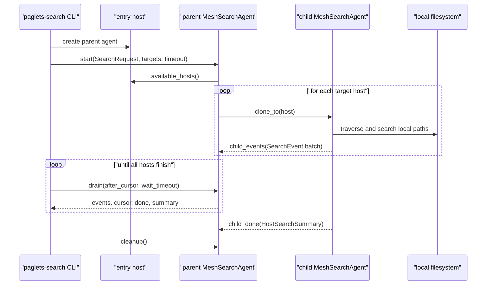
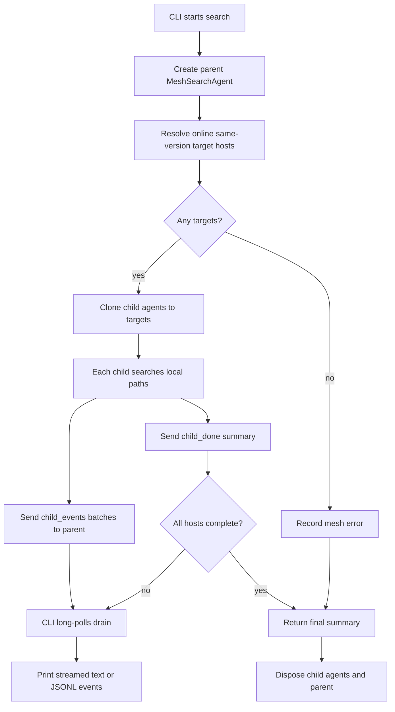

# Example Agents

`paglets` ships six packaged example agents that demonstrate different runtime
patterns without mixing application code into the root runtime namespace:

- `paglets.examples.system_info`: a resident typed service agent plus a
  mesh-wide collector CLI.
- `paglets.examples.mesh_info`: an eager resident mesh resource landscape
  service plus a summary/target-selection CLI.
- `paglets.examples.compute`: a coordinator/worker decimal Pi compute example
  plus a mesh-aware CLI.
- `paglets.examples.performance`: a pure mobile benchmark agent plus a
  mesh-wide benchmark CLI.
- `paglets.examples.mesh_benchmark`: a directional mesh movement benchmark
  with a stable starter and one mobile traveler.
- `paglets.examples.search`: a pure mobile filesystem search agent plus a
  streaming mesh search CLI.

The root `paglets` package is reserved for runtime infrastructure such as
`Paglet`, `Host`, `Message`, service contracts, mesh discovery, startup config,
and transfer mechanics. Example agents live under `paglets.examples.*` so their
imports make that boundary explicit.

## Running The Examples

Start two same-version hosts:

```bash
uv run paglets-host --name alpha --port 8765 --mesh-version dev
uv run paglets-host --name beta --port 8766 --peer http://127.0.0.1:8765 --mesh-version dev
```

For hosts on different machines, use `--bind-public` so each host binds and
publishes a reachable LAN address:

```bash
uv run paglets-host --name mac --bind-public --port 8765 --mesh-version dev
uv run paglets-host --name windows --bind-public [IP] --port 8765 --mesh-version dev
```

`--bind-public` without an `IP` binds only the detected LAN address. Supplying
an `IP` binds only that address, which is useful on machines with multiple
network interfaces. Repeat the flag to bind multiple specific addresses; the
first one is published to the mesh. The auto form keeps watching for LAN
address changes and rebinds/publishes the new address after DHCP or network
reconnect changes it.

On first start, `paglets-host` copies the bundled demo launch config to
`~/.paglets/launch.toml`. The bundled config declares lazy `server-info` and
eager `mesh-info` services:

```toml
[launch]
demo_config_id = "paglets-default-launch"
demo_config_version = "4"

[[resident_services]]
class = "paglets.examples.system_info.agent:ServerInfoAgent"
enabled = true
agent_id = "service.server-info"
singleton = true
lifecycle = "lazy"
scope = "mesh"
idle_timeout = 30.0
state = { service_scope = "mesh" }

[[resident_services]]
class = "paglets.examples.mesh_info.agent:MeshInfoAgent"
enabled = true
agent_id = "service.mesh-info"
singleton = true
lifecycle = "eager"
scope = "mesh"
idle_timeout = 0.0
state = { service_scope = "mesh" }
```

The command-line examples dynamically discover a reachable entry host from
local/LAN probes and mesh multicast beacons. The entry host is only the
bootstrap point; mesh-aware examples still discover and use online
same-version mesh hosts automatically. There is no saved server/IP membership
file to maintain.

```bash
uv run paglets-sysinfo [--entry alpha] df
uv run paglets-mesh-info [--entry alpha] summary
uv run paglets-pi-compute [--entry alpha] --digits 16
uv run paglets-perf-test [--entry alpha]
uv run paglets-search [--entry alpha] grep TODO .
```

There is no authentication layer yet. These examples are useful for trusted
local or lab meshes, not untrusted networks.

## Server Info

`server-info` demonstrates the resident-service pattern:

1. A host declares `ServerInfoAgent` from launch config.
2. The host advertises a typed service contract named `server-info` before the
   provider is active.
3. A caller discovers that contract locally or across the mesh.
4. The first call starts or activates the provider agent.
5. Requests are ordinary paglet messages, but payloads and replies are typed
   dataclasses.
6. The `paglets-sysinfo` CLI creates a short-lived collector paglet that clones
   to mesh hosts, calls each host's local `server-info` service, polls `drain`,
   and prints an aggregate result.
7. After the idle timeout, the provider deactivates while the service remains
   discoverable for later calls.

### Contract And Operations

Import the example contract explicitly from the example package:

```python
from paglets.examples.system_info import (
    GET_DISK,
    GET_LOAD,
    GET_SUMMARY,
    LIST_PROCESSES,
    SERVER_INFO,
    DiskRequest,
    LoadRequest,
    ProcessListRequest,
)
```

The contract has four operations:

| Operation | Request | Reply | Purpose |
| --- | --- | --- | --- |
| `GET_LOAD` / `load` | `LoadRequest` | `LoadReply` | CPU percent, load average, memory, swap, and best-effort GPU info. |
| `GET_DISK` / `df` | `DiskRequest` | `DiskReply` | Disk usage for selected paths or mounted volumes. |
| `LIST_PROCESSES` / `plist` | `ProcessListRequest` | `ProcessListReply` | Process search by name or command line. |
| `GET_SUMMARY` / `summary` | `EmptyPayload` | `SummaryReply` | Compact host, Python, CPU, memory, and boot summary. |

Provider-side routing is in `ServerInfoAgent.handle_message`:

```python
return SERVER_INFO.route(
    message,
    {
        GET_LOAD: self.get_load,
        GET_DISK: self.get_disk,
        LIST_PROCESSES: self.list_processes,
        GET_SUMMARY: self.get_summary,
    },
    default=self.not_handled(),
)
```

Consumer code can call the typed service directly:

```python
from paglets import ServiceScope
from paglets.examples.system_info import GET_DISK, SERVER_INFO, DiskRequest

service = self.require_contract(SERVER_INFO, operation=GET_DISK, scope=ServiceScope.MESH)
reply = service.call(GET_DISK, DiskRequest(paths=["/"], all_volumes=False))
```

### CLI Commands

`paglets-sysinfo` provides familiar host-inspection commands across the mesh:

```bash
uv run paglets-sysinfo summary
uv run paglets-sysinfo load
uv run paglets-sysinfo df
uv run paglets-sysinfo df / /data
uv run paglets-sysinfo plist python --limit 10
uv run paglets-sysinfo plist postgres --args --json
```

The CLI discovers a reachable entry host automatically. Use optional
`--entry HOSTNAME` to choose one discovered entry host by name, then the
collector paglet discovers online same-version mesh hosts.

### Collector Flow

The collector is `SystemInfoCollectorAgent`. It is not a resident service:

1. The CLI creates one collector on the entry host.
2. The collector calls `available_hosts(online_only=True, include_self=True)`.
3. It clones itself to each host.
4. Each child clone resolves the local `SERVER_INFO` contract and calls the
   requested operation with `scope=ServiceScope.LOCAL`, starting lazy providers
   on demand.
5. Each child sends a `child_result` message back to the parent.
6. The parent returns a summary with `results` and `errors`.

This pattern keeps collection logic mobile while the service itself stays local
to each host. The parent protects `pending_hosts`, `results`, and `errors` with
short `locked_state()` and `@state_locked` sections because child replies can
arrive while the parent is still waiting.

### GPU And Process Notes

GPU information is best effort. The agent runs `nvidia-smi` if available; when
the command is missing or fails, the reply records the reason instead of failing
the whole request.

Process inspection uses `psutil`. Processes that disappear or deny access while
being read are skipped so one protected process does not fail the whole host
reply.

## Mesh Info

`mesh-info` is an eager resident service that keeps a fresh resource snapshot
for each visible host. It samples local CPU, memory, swap, work-directory disk
space, and active/inactive paglet counts, then exchanges bounded snapshot
batches with peer `mesh-info` services.

The core contract is:

```python
from paglets.examples.mesh_info import MESH_INFO, GET_LANDSCAPE, SELECT_TARGETS
```

Useful CLI commands:

```bash
uv run paglets-mesh-info summary
uv run paglets-mesh-info targets --max-load-per-cpu 1.0 --min-work-free 1G
uv run paglets-mesh-info targets --json
```

The `summary` command prints the fresh landscape known to the entry host. The
`targets` command applies placement constraints and ranks eligible hosts by
load, CPU, memory pressure, and work-storage pressure. Both text tables include
active and inactive paglet counts for each host. Use optional `--entry
HOSTNAME` to choose a discovered entry host by name.

Programmatic target selection:

```python
from paglets import ServiceScope
from paglets.examples.mesh_info import MESH_INFO, SELECT_TARGETS, TargetSelectionRequest

mesh_info = self.require_contract(MESH_INFO, operation=SELECT_TARGETS, scope=ServiceScope.LOCAL)
targets = mesh_info.call(
    SELECT_TARGETS,
    TargetSelectionRequest(limit=4, max_load_per_cpu=1.0, min_work_free_bytes=1024**3),
)
```

`mesh-info` is intentionally a resident service rather than a one-shot clone
collector: each host maintains its own current view, and schedulers can query
the nearest local service repeatedly without fan-out for every placement
decision.

## Pi Compute

`paglets-pi-compute` demonstrates using `mesh-info` as lightweight placement
input for a distributed compute job. It computes decimal digits of Pi by
distributing Chudnovsky term batches and combining the integer partial sums on
the coordinator.

```bash
uv run paglets-pi-compute --digits 16 --batch-size 1
uv run paglets-pi-compute --digits 32 --max-load-per-cpu 0.75 --max-workers-per-host 2 --json
```

The coordinator stays on the dynamically discovered entry host, partitions the
requested digit range into the required Chudnovsky terms, asks local
`mesh-info` for eligible targets across the mesh, treats approximate free load
slots as additional launch capacity, creates short-lived
`PiBatchWorkerAgent` instances remotely, and receives `batch_result` messages.
Worker creation requests are issued in parallel so process-spawn overhead does
not keep free slots empty. The free-slot estimate is based on `cpu_count *
--max-load-per-cpu - load_1m`; existing in-flight workers are added back before
new launches are capped by `--max-workers-per-host`. `--max-in-flight` caps the
whole job. A dedicated `PiPostProcessAgent` runs on the entry host for each
active job; it incrementally merges finalized term fragments and performs
`drain`/`format` work so the coordinator can focus on scheduling and state
tracking.

In text mode the CLI starts the coordinator asynchronously, long-polls with
`drain_stream`, and appends each returned decimal fragment to the terminal.
`drain_stream` first refills worker slots, then returns compact progress counters
and new text only; it does not return the full raw term history, keeping messages
small while preserving `3.1415...` output. Increase
`--stream-chunk-size` when larger terminal bursts are useful. Use `--json` for a
final summary object instead of live output. The default job timeout is disabled
so long calculations can run to completion; add `--timeout SECONDS` when a run
should be bounded, and increase `--request-timeout` if an exceptionally large
coordinator response needs longer than the default HTTP request window. Workers
re-check local load before computing; if a host has become busy, the worker
reports `skipped`, the coordinator requeues that batch, and the worker disposes
itself. If all hosts are above the load/CPU thresholds and no batch is running,
the coordinator sends one fallback worker anyway so a long job still makes
minimum progress.

The worker result payloads encode large Chudnovsky partial integers in
hexadecimal internally. The coordinator forwards only finalized `ok` term fragments
to the post-processor for incremental merge; the post-processor formats digits
on demand. This keeps scheduling messages compact and avoids expensive terminal-side
recombination while still producing normal `3.1415...` output and avoiding Python
integer string conversion limits for very large jobs.

Programmatic use:

```python
from paglets.examples.compute import PiComputeCoordinatorAgent, PiComputeRequest
from paglets.messages import Message
from paglets.serde import dataclass_to_wire

coordinator = self.context.create_paglet(PiComputeCoordinatorAgent)
summary = coordinator.send(
    Message(
        "start",
        {"request": dataclass_to_wire(PiComputeRequest(start=0, digits=16, batch_size=1))},
    )
)
```

## Performance Benchmark

`paglets-perf-test` demonstrates a pure mobile-agent fan-out pattern. It does
not use a resident service and it is not started from launch config. The
benchmark code is carried by the mobile agent class itself.

The core agent is:

```python
from paglets.examples.performance import PerformanceBenchmarkAgent
```

The CLI creates one parent benchmark agent on the entry host. The parent clones
children to online same-version mesh hosts. Each child runs benchmarks locally
and sends one result back to the parent. The CLI polls the parent with `drain`
until all hosts have replied. Parent result bookkeeping uses the paglet state
lock, but the actual benchmark work and remote calls happen outside that lock.

### Benchmarks

The default run includes all categories:

| Category | Measurements |
| --- | --- |
| CPU single-core | Python integer loop, Python float loop, SHA-256 throughput. |
| CPU multi-core | Same kernels through worker processes. |
| Memory | Byte-buffer copy throughput and byte-buffer scan/checksum throughput. |
| Disk | Sequential write, fsync, sequential read, and small-file metadata rate. |

Disk benchmarks are intentionally bounded:

- only writable real volumes are selected by default;
- when a mountpoint is not directly writable, the benchmark also tries
  per-user writable directories such as `~/.paglets/benchmarks` and the OS temp
  directory on that same volume;
- special, pseudo, read-only, duplicate, missing, and unwritable volumes are
  skipped;
- each tested volume gets a temporary benchmark directory;
- temporary files are cleaned up afterward;
- a volume is skipped if free space is less than twice the requested test size.

Normal text output hides skipped read-only, special, and duplicate targets. Use
`--verbose` or `--debug` when you want to inspect those skipped targets. JSON
output always includes the full skipped-target list.

These numbers are practical comparison data for a paglets mesh. They are not
calibrated hardware certification results.

### CLI Commands

Run all benchmark categories:

```bash
uv run paglets-perf-test
```

Useful variations:

```bash
uv run paglets-perf-test --json
uv run paglets-perf-test --duration 2 --disk-size 256M
uv run paglets-perf-test --path /data --path /scratch
uv run paglets-perf-test --no-disk
uv run paglets-perf-test --workers 4
uv run paglets-perf-test --verbose
```

Example with two local hosts running in separate terminals:

```bash
uv run paglets-host --name alpha --port 8765 --mesh-version dev
uv run paglets-host --name beta --port 8766 --peer http://127.0.0.1:8765 --mesh-version dev
```

Across machines, use `--bind-public [IP]` on each host instead of loopback.
Repeat `--bind-public IP` only when the host must listen on multiple specific
interfaces.

Then run the benchmark from the repository checkout:

```text
klukas@mac-studio paglets % uv run paglets-perf-test
host                int/s    float/s        sha  multi-int/s   mem copy    disk wr    disk rd err
alpha               17.2M      19.8M     2.1G/s       140.2M    30.6G/s     3.7G/s    16.0G/s   0
beta                17.2M      20.0M     2.2G/s       147.6M    31.0G/s     3.4G/s    15.7G/s   0

disks:
host           path                                  size      write       read   metadata
alpha          /Users/klukas/.paglets/benchmark    128.0M     3.7G/s    16.0G/s      9130/s
beta           /Users/klukas/.paglets/benchmark    128.0M     3.4G/s    15.7G/s      9301/s
```

Important options:

| Option | Meaning |
| --- | --- |
| `--duration` | Seconds per CPU and memory kernel. Default: `1.0`. |
| `--disk-size` | Temporary file size per tested volume. Default: `128M`. |
| `--workers` | Multi-core worker count. Default: logical CPU count. |
| `--path` | Limit disk I/O to explicit paths. Can be repeated. |
| `--no-cpu` | Skip CPU tests. |
| `--no-memory` | Skip memory tests. |
| `--no-disk` | Skip disk I/O tests. |
| `--lock-timeout` | Seconds to wait for another local benchmark run to finish. |
| `--verbose` | Print skipped disk targets and cleanup diagnostics. |
| `--debug` | Same diagnostic output as `--verbose`. |

### Agent Flow

The benchmark agent uses cloning because benchmark work should run in parallel
on different hosts:

1. The CLI creates a parent `PerformanceBenchmarkAgent` on the entry host.
2. The parent discovers online same-version mesh hosts.
3. The parent clones a child to each host.
4. Each child starts benchmark work in a background thread so clone arrival does
   not serialize the fan-out.
5. Children on different hosts run in parallel.
6. A host-local benchmark lock prevents two benchmark children on the same
   server from running expensive tests at the same time.
7. Each child reports `HostBenchmarkResult` or an error to the parent.
8. The parent wakes any `drain` call waiting for completion.
9. The CLI returns a summary with `results`, `errors`, and non-fatal
   `cleanup_errors`.

The lock has two layers: a process-local `threading.Lock` for threads inside one
benchmark child, and a best-effort OS file lock in the system temp directory.
The OS file lock is the important cross-process guard in the process-isolated
runtime; it serializes benchmark paglets started by the same user on the same
machine while still allowing different physical hosts to work in parallel.

### Programmatic Use

The request and reply dataclasses are importable:

```python
from paglets.examples.performance import BenchmarkRequest, PerformanceBenchmarkAgent
from paglets.messages import Message
from paglets.serde import dataclass_to_wire

proxy = self.context.create_paglet(PerformanceBenchmarkAgent)
summary = proxy.send(
    Message(
        "collect",
        {
            "request": dataclass_to_wire(
                BenchmarkRequest(duration_seconds=0.5, disk_size_bytes=64 * 1024 * 1024)
            ),
            "timeout": 120.0,
        },
    )
)
```

Most applications should use the `paglets-perf-test` CLI unless they need to
embed benchmark collection into another paglet workflow.

## Mesh Movement Benchmark

`paglets-mesh-benchmark` measures the cost of moving a paglet through the mesh
instead of measuring CPU, memory, or disk throughput. The entry host keeps a
starter/coordinator agent active and sends one mobile traveler across every
directed host pair.

Run the default directional route:

```bash
uv run paglets-mesh-benchmark
```

Useful variations:

```bash
uv run paglets-mesh-benchmark --repeats 3
uv run paglets-mesh-benchmark --payload-size 64K
uv run paglets-mesh-benchmark --exclude-self
uv run paglets-mesh-benchmark --clock-probes 7 --digits 4
uv run paglets-mesh-benchmark --json
```

The text output is Markdown that is also padded for plain terminal reading. It
prints one timing unit before the matrix, then reports source hosts as rows and
destination hosts as columns. Cell A/B contains only A->B samples; cell B/A
contains only B->A samples. When self-visits are disabled, diagonal cells are
shown as `-`.

Timing is based on the stable starter clock. Before each dispatch, the traveler
probes the starter, estimates entry-host time for the local instant immediately
before `dispatch()`, and carries that timestamp with the traveler. On arrival,
the traveler captures its local arrival time before the delayed continuation,
then uses the next starter probe batch to convert that captured arrival instant
back to entry-host time. The stored per-hop duration excludes the post-arrival
probe time and the continuation delay. At the end, the traveler performs an
uncounted collection round, clears the run's local storage files, and sends the
summary back to the starter.

Clock diagnostics use repeated request/reply probes against the starter. The
displayed value is the median host-minus-entry offset; JSON output also
includes raw samples, mean offset, and the offset from the best round-trip
probe. The same probe samples are aggregated into a separate message passing
table with median, average, best, and worst request/reply round-trip times
versus the starter. The final line reports the overall benchmark time from
start through the collection round.

## Mesh Search

`paglets-search` demonstrates a practical mobile-agent use case: move the
search logic to each host, scan local files there, and send only hits back to
the caller. This avoids repeatedly pulling remote file contents to one machine
and gives the caller incremental results while hosts are still scanning.

The core agent is:

```python
from paglets.examples.search import MeshSearchAgent
```

It is a pure mobile agent, not a resident service. The CLI creates one parent
`MeshSearchAgent` on the entry host. The parent clones child agents to target
hosts, children search local paths, and search events travel back to the parent
as ordinary paglet messages.

The command combines common `ripgrep` content search and `fd` filename search
features:

```bash
uv run paglets-search grep TODO .
uv run paglets-search grep -C 2 -t py "class .*Agent" src tests
uv run paglets-search grep -i --hidden -g "*.md" paglets docs
uv run paglets-search find README .
uv run paglets-search find report --extension md --kind file
uv run paglets-search --jsonl grep TODO .
```

By default the CLI dynamically discovers a reachable entry host, then the
parent search paglet clones to all online same-version mesh hosts, including
the entry host. Restrict the search to specific hosts with repeated `--host`
flags:

```bash
uv run paglets-search --host alpha --host beta grep TODO /srv/app
```

Paths are interpreted locally by each target host process. Searching `.` means
the current working directory of each host, not the directory where the CLI is
running.

### Agent API

The search example exports the agent, state, request, event, and summary
dataclasses:

```python
from paglets.examples.search import (
    HostSearchSummary,
    MeshSearchAgent,
    MeshSearchState,
    SearchEvent,
    SearchRequest,
)
```

`SearchRequest` is the serializable command surface. It covers two modes:

| Mode | Purpose |
| --- | --- |
| `grep` | Search file contents and emit match, context, count, or file events. |
| `find` | Search file, directory, or symlink names and emit file events. |

`SearchEvent` is the streamed event type. Match events include host, path, line
number, column, full line text, matching text, and match offsets for optional
highlighting. Context events carry neighboring lines. File and count events are
used for filename search, `-l`, `--files-without-match`, and `-c`.

`HostSearchSummary` records per-host totals such as scanned files, matched
files, match counts, path counts, errors, truncation, and duration. The parent
agent's final summary groups these host summaries under `results` and records
host-level failures under `errors`.

### Streaming Flow

The search agent uses message delivery rather than polling a remote filesystem:

1. The CLI creates one parent `MeshSearchAgent` on the entry host.
2. The parent discovers target hosts and clones child agents to them.
3. Each child traverses local paths with Python APIs and sends hit batches back
   to the parent as paglet messages.
4. The parent appends events to state and wakes any `drain` call waiting for new
   events.
5. The CLI long-polls `drain`, printing events as soon as they arrive.

Inside a host, incoming paglet messages already invoke `handle_message()`
through the mailbox. There is no need for a paglet to busy-poll its mailbox.
The search parent uses `wait_state()` so a `drain` request sleeps efficiently
until a child message adds more events, all hosts finish, or the timeout elapses.
This start/drain shape is important because active paglets process one message
at a time in their child process. A parent message handler should not block
waiting for child result messages that must be delivered to that same parent.

The parent handles these messages:

| Message | Purpose |
| --- | --- |
| `start` | Store the `SearchRequest`, resolve targets, clone children, and return target metadata. |
| `child_events` | Append streamed hit events from a child and wake waiting drain calls. |
| `child_done` | Record the child host summary or host error and mark the host complete. |
| `drain` | Long-poll for events after a cursor, returning immediately when new events arrive. |
| `summary` | Return current aggregate state. |
| `cleanup` | Dispose child agents after the CLI has finished. |

### Flow Diagrams

The below Mermaid `sequenceDiagram` explains the calling sequence
between the CLI, entry host, parent search paglet, child paglets, and local
filesystems:



The following Mermaid `flowchart` explains the parent and child program
flow without focusing on every individual call:



### Search Options

Useful content-search options:

| Option | Meaning |
| --- | --- |
| `-i`, `-S` | Ignore case, or use smart case. |
| `-F` | Treat the pattern as a literal string. |
| `-w` | Match whole words. |
| `-A`, `-B`, `-C` | Include context lines around matches. |
| `-o` | Print only matching text. |
| `-c` | Print matching-line counts per file. |
| `-l`, `--files-without-match` | Print only matching or non-matching file paths. |
| `-g` | Include or exclude glob patterns; prefix with `!` to exclude. |
| `-t`, `-T` | Include or exclude supported file types. |
| `--hidden`, `--no-ignore`, `--follow` | Control hidden paths, ignore files, and symlinks. |
| `--max-depth`, `--max-file-size`, `--max-results-per-host` | Bound local work. |

Useful filename-search options:

| Option | Meaning |
| --- | --- |
| `--full-path` | Match against the full path instead of only the basename. |
| `-e`, `--extension` | Limit results to one extension; repeatable. |
| `--kind` | Emit only `file`, `dir`, `symlink`, or `any` paths. |

The implementation is intentionally a practical subset, not a byte-for-byte
clone of `ripgrep` or `fd`. Use `paglets-search --help`,
`paglets-search grep --help`, `paglets-search find --help`, and
`paglets-search --type-list` for the supported command surface.

### Programmatic Use

Most users should use `paglets-search`, but other paglets can create the search
agent directly and drain streamed events:

```python
from paglets.examples.search import MeshSearchAgent, SearchRequest
from paglets.messages import Message
from paglets.serde import dataclass_to_wire

proxy = self.context.create_paglet(MeshSearchAgent)
proxy.send(
    Message(
        "start",
        {
            "request": dataclass_to_wire(
                SearchRequest(mode="grep", pattern="TODO", paths=["."])
            ),
            "timeout": 60.0,
        },
    )
)

cursor = 0
while True:
    reply = proxy.send(
        Message("drain", {"after_cursor": cursor, "wait_timeout": 0.5, "limit": 100})
    )
    for event in reply["events"]:
        cursor = max(cursor, int(event["cursor"]))
        # Render or forward the event here.
    if reply["done"]:
        break

summary = reply["summary"]
proxy.send(Message("cleanup"))
proxy.dispose()
```

## Source-Tree Demos

The repository also has simple runnable demos under the top-level `examples/`
directory. These are not installed as packaged example modules; they are small
scripts meant for reading and experimentation from a checkout:

```bash
uv run python examples/disk_survey_demo.py --hosts alpha beta gamma
uv run python examples/clone_workers_demo.py
uv run python examples/itinerary_demo.py
uv run python examples/message_patterns_demo.py
```

The bundled scripts re-import themselves as `examples.<module>` before creating
paglets, so their classes are importable by spawned child processes. For your
own examples, keep paglet classes in importable modules and let the script entry
point only call into that module.

Use packaged examples when you want installed CLI commands or importable example
agents. Use source-tree demos when you want compact scripts that illustrate one
runtime concept at a time.
