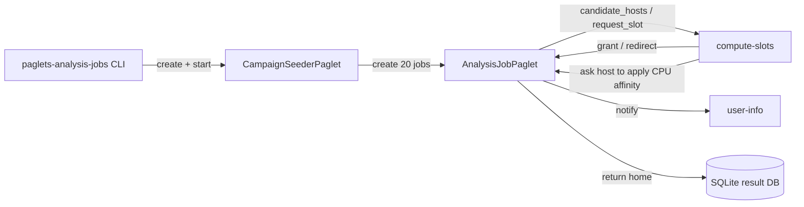
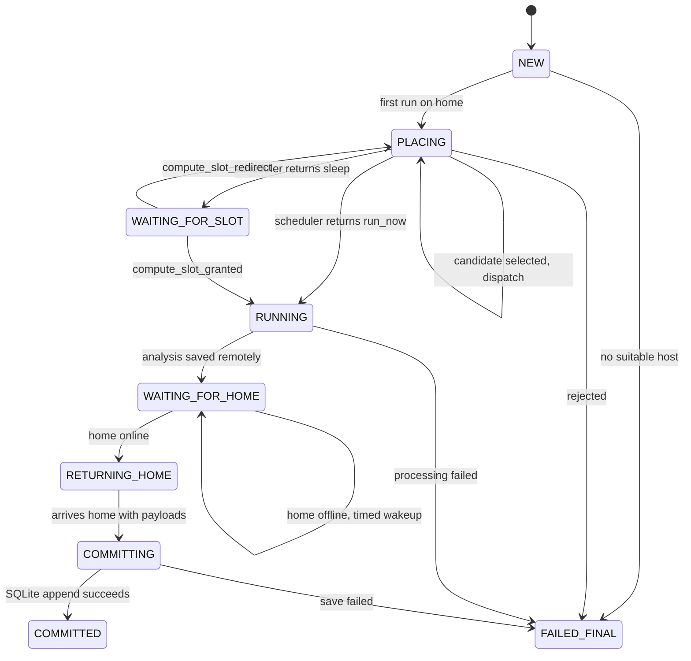
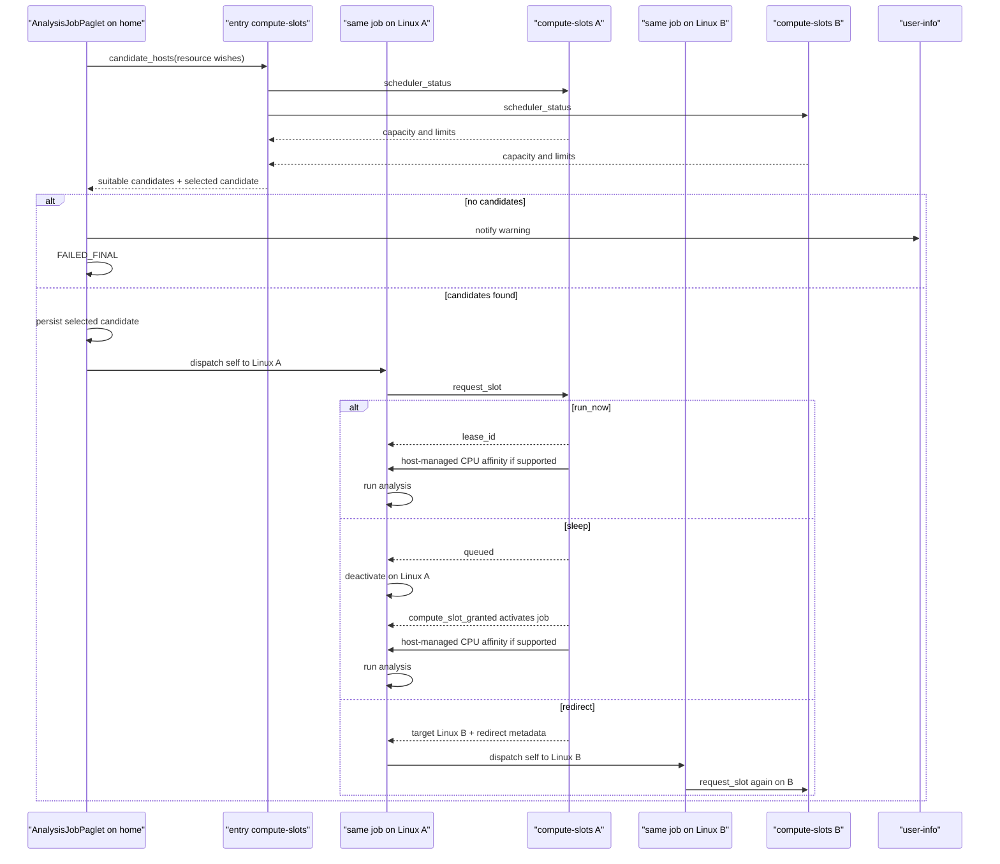
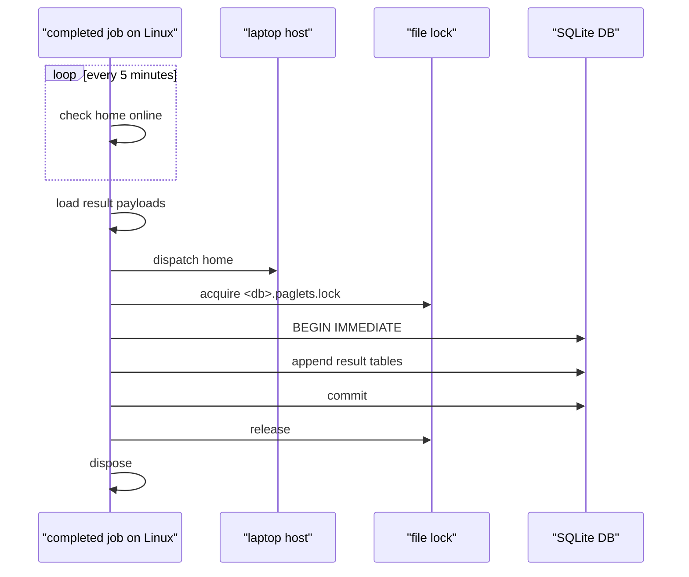

# Analysis Jobs

`paglets-analysis-jobs` is a synthetic distributed dataframe analysis example.
It demonstrates how application paglets can use the built-in
[Compute Slots](../system/compute-slots.md) scheduler without putting
application-specific result collection into the scheduler itself.

The example starts on the laptop/home host, creates configurable job paglets,
sends them to suitable Linux compute hosts, waits for scheduler grants, performs
synthetic pandas/scikit-learn work, stores result frames while the laptop is
offline, then returns home and appends results to SQLite under a cross-process
file lock.

## Running It

Start a laptop/home host and one or more Linux-style compute hosts in the same
mesh:

```bash
uv run paglets-host --name laptop --bind-public --port 8765 --mesh-version analysis
uv run paglets-host --name linux-a --bind-public --peer http://laptop:8765 --port 8765 --mesh-version analysis
uv run paglets-host --name linux-b --bind-public --peer http://laptop:8765 --port 8765 --mesh-version analysis
```

Start the campaign from the laptop host:

```bash
uv run paglets-analysis-jobs --entry laptop --tasks 20
```

Useful shorter development run:

```bash
uv run paglets-analysis-jobs --entry laptop --tasks 3 --rows 2000 --target-runtime 3
```

The default target runtime is about 2-3 minutes per job. The job pads with CPU
work when the actual model training finishes sooner.

## Components



`CampaignSeederPaglet`
: Runs on the home host. It creates a configurable number of
  `AnalysisJobPaglet` instances and records their IDs.

`AnalysisJobPaglet`
: Derives from `ComputeJobPaglet`. It carries job configuration, resource
  wishes, SQLite DB path, and result metadata. The base class captures the home
  host and carries scheduler request IDs, lease IDs, redirects, completion
  state, and affinity metadata.

`compute-slots`
: Filters suitable hosts, queues waiting jobs, grants leases, and redirects
  sleepers through bounded work stealing.

`user-info`
: Prints user-facing notifications from jobs.

## How The Job Is Implemented

The example has two paglet classes:

- `CampaignSeederPaglet` runs once on the home host and creates many
  `AnalysisJobPaglet` instances.
- `AnalysisJobPaglet` is the actual compute job. It derives from
  `ComputeJobPaglet`, so it only implements analysis and result handling.

The application state extends `ComputeJobState`. Scheduler resource estimates
are normal state fields, while analysis-specific fields such as `job_id`,
`seed`, `db_path`, and result paths belong to this example:

<div class="paglets-code-source">Source: <a href="https://github.com/cklukas/paglets/blob/main/src/paglets/examples/analysis_jobs/agent.py">AnalysisJobState in agent.py</a></div>

```python
--8<-- "src/paglets/examples/analysis_jobs/agent.py:analysis-job-state"
```

The seeder creates one state object per task. This is where the application
assigns its own `job_id` and resource estimates. The compute scheduler later
uses `cpu_cores`, `memory_bytes`, `temp_storage_bytes`, and
`estimated_runtime_seconds`; it does not interpret the analysis `job_id`.

<div class="paglets-code-source">Source: <a href="https://github.com/cklukas/paglets/blob/main/src/paglets/examples/analysis_jobs/agent.py">CampaignSeederPaglet._seed_jobs in agent.py</a></div>

```python
--8<-- "src/paglets/examples/analysis_jobs/agent.py:seed-jobs"
```

The compute part is intentionally concentrated in `run_compute_job()`. The base
class calls this method only after a compute slot has been granted. It also
releases the lease when the method returns or raises.

<div class="paglets-code-source">Source: <a href="https://github.com/cklukas/paglets/blob/main/src/paglets/examples/analysis_jobs/agent.py">AnalysisJobPaglet.run_compute_job in agent.py</a></div>

```python
--8<-- "src/paglets/examples/analysis_jobs/agent.py:run-compute-job"
```

After the compute method returns, the job may need several wakeups before the
home laptop is online again. That repeated post-compute behavior belongs in
`continue_after_compute_success()`:

<div class="paglets-code-source">Source: <a href="https://github.com/cklukas/paglets/blob/main/src/paglets/examples/analysis_jobs/agent.py">AnalysisJobPaglet.continue_after_compute_success in agent.py</a></div>

```python
--8<-- "src/paglets/examples/analysis_jobs/agent.py:continue-after-success"
```

`_try_return_home()` is application logic, not scheduler logic. It checks
whether the home host is visible, deactivates for a timed retry when the laptop
is offline, or dispatches the paglet home when the laptop is online:

<div class="paglets-code-source">Source: <a href="https://github.com/cklukas/paglets/blob/main/src/paglets/examples/analysis_jobs/agent.py">AnalysisJobPaglet._try_return_home in agent.py</a></div>

```python
--8<-- "src/paglets/examples/analysis_jobs/agent.py:try-return-home"
```

Once back home, the example serializes only the final SQLite write. Compute,
movement, and payload loading are not locked:

<div class="paglets-code-source">Source: <a href="https://github.com/cklukas/paglets/blob/main/src/paglets/examples/analysis_jobs/agent.py">AnalysisJobPaglet._commit_at_home in agent.py</a></div>

```python
--8<-- "src/paglets/examples/analysis_jobs/agent.py:commit-at-home"
```

Failure handling is deliberately small. The base class already sets
`compute_status = FAILED_FINAL`, records `compute_error`, and releases any
lease. The example only mirrors the failure into its application status and
sends a notification:

<div class="paglets-code-source">Source: <a href="https://github.com/cklukas/paglets/blob/main/src/paglets/examples/analysis_jobs/agent.py">AnalysisJobPaglet.after_compute_failure in agent.py</a></div>

```python
--8<-- "src/paglets/examples/analysis_jobs/agent.py:after-compute-failure"
```

Everything not shown here is either ordinary data processing in
`workload.py` or private helper code for saving/loading result payloads. New
compute job types should usually need the same small surface: a state dataclass,
`run_compute_job()`, optional post-compute return/commit logic, and optional
failure notification.

## Compute Job API Usage

The example is intentionally small at the scheduler boundary. `AnalysisJobPaglet`
does not implement placement, candidate selection, local slot requests, sleep,
redirect handling, affinity assignment, or lease release. Those mechanics come
from `ComputeJobPaglet`.

The example implements only the application-specific hooks:

| Method | Why the example implements it | What the base class still owns |
| --- | --- | --- |
| `handle_compute_job_message()` | Adds a `status` message that returns the analysis job state for diagnostics. | Scheduler messages such as `compute_slot_granted` and `compute_slot_redirect`. |
| `run_compute_job()` | Runs the pandas/scikit-learn workload after a slot was granted, stores result payloads on the compute host, and changes application `status` to `WAITING_FOR_HOME`. | Starting this method only after a lease exists, recording affinity metadata, and releasing the lease after the method returns or fails. |
| `continue_after_compute_success()` | Handles the post-compute phase: wait for home, dispatch home, or commit once already returning. This hook can run more than once after timed wakeups. | Calling this hook when compute first completes and again when a completed paglet wakes. |
| `after_compute_failure(message)` | Copies the failure into application fields and sends a user notification. | Marking `compute_status = FAILED_FINAL`, recording `compute_error`, and releasing any lease. |

The example also has private application helpers, not scheduler hooks:

- `_try_return_home()` checks whether the laptop/home host is online. If not, it
  deactivates with a timed wakeup. If yes, it loads result payloads and dispatches
  the paglet home.
- `_commit_at_home()` appends result frames to SQLite under the file lock,
  notifies the user, and disposes the completed paglet.
- `_save_payloads()` and `_load_payloads()` move serialized result frames between
  local persistent storage and mobile paglet state.

There are two status fields by design:

| Field | Owner | Values in this example |
| --- | --- | --- |
| `compute_status` | `ComputeJobPaglet` | `NEW`, `PLACING`, `WAITING_FOR_SLOT`, `RUNNING`, `COMPLETED`, `FAILED_FINAL`. |
| `status` | `AnalysisJobPaglet` | `NEW`, `RUNNING`, `WAITING_FOR_HOME`, `RETURNING_HOME`, `COMMITTING`, `COMMITTED`, `FAILED_FINAL`. |

New compute job types should normally copy this shape: put resource estimates
and domain configuration in a `ComputeJobState` subclass, implement
`run_compute_job()`, and add `continue_after_compute_success()` only when
results need a return/wait/commit phase.

## Job State Machine



## Placement And Scheduling Flow



The initial target is selected by `compute-slots` from suitable ranked
candidates. `ComputeJobPaglet` persists that target, dispatches itself there,
and carries redirect metadata so peer schedulers can apply cooldown hysteresis.

## Synthetic Workload

Each job:

1. Generates deterministic synthetic classification data from its job seed.
2. Converts the data into a pandas dataframe.
3. Receives scheduler affinity metadata; the scheduler asks the host to pin the
   job process when the platform supports affinity.
4. Trains a scikit-learn random forest with `n_jobs=1`.
5. Computes prediction accuracy.
6. Produces three result frames:
   - `job_summary`
   - `feature_summary`
   - `prediction_summary`
7. Pads with CPU work until the configured target runtime is reached.

The defaults are intentionally large enough to make scheduling observable:

- `DEFAULT_TASK_COUNT = 20`
- `DEFAULT_ROW_COUNT = 80000`
- `DEFAULT_FEATURE_COUNT = 32`
- `DEFAULT_ESTIMATOR_TREES = 80`
- `DEFAULT_TARGET_RUNTIME_SECONDS = 150`

Lower these values for tests or demos on small machines.

## Result Collection

Result collection is application-specific. In this example, jobs return home and
append to a SQLite database.

While the laptop is offline, a completed job stores result payloads in its
paglet persistent storage on the compute host. Every five minutes it wakes and
checks whether the home host is online.

When home is visible, the job loads the result payloads into mobile state,
dispatches home, and writes the SQLite tables:

- `job_summary`
- `feature_summary`
- `prediction_summary`

`job_summary` includes the scheduler and affinity outcome for the run:

- `cpu_core_ids`, the concrete CPU IDs granted on affinity-capable hosts.
- `cpu_affinity_supported`, whether this host can enforce process affinity.
- `cpu_affinity_enforced`, whether the job process was actually pinned before
  the workload started.
- `cpu_affinity_error`, the non-fatal reason when pinning was requested but not
  enforced.

SQLite writes are serialized with a cross-process file lock at:

```text
<db_path>.paglets.lock
```

The example also uses `BEGIN IMMEDIATE` so the SQLite transaction obtains a
write lock before appending frames.



## Implementing Your Own Job Paglet

Use this example as a template for the application-specific parts of a compute
job. The reusable scheduling mechanics live in `ComputeJobState` and
`ComputeJobPaglet`; new job types should not reimplement candidate selection,
slot requests, redirects, sleep handling, affinity metadata, or lease release.

- Put scheduler fields in a state class derived from `ComputeJobState`.
- Put job configuration and progress in the same dataclass state.
- Derive the job paglet from `ComputeJobPaglet`.
- Estimate CPU cores, RAM, temp storage, runtime, and GPU needs before
  placement.
- Set `estimated_runtime_seconds` in the state and implement `run_compute_job()`.
- Use application-specific fields such as `job_id`, `dataset_name`, or
  `result_key` for result labels.
- Let the base class own advancement, scheduler wakeups, and lease release.
- Use `continue_after_compute_success()` when a completed job needs to wake
  later, return home, or commit results after compute has finished.
- Store results before waiting for home or another destination.
- Keep final result collection task-specific.
- Use application-specific fields for result states such as `WAITING_FOR_HOME`
  or `COMMITTING`; `compute_status` is reserved for the scheduling base.
- Send user-facing messages through the base `notify_user()` helper, which uses
  [User Info](../system/user-info.md).
