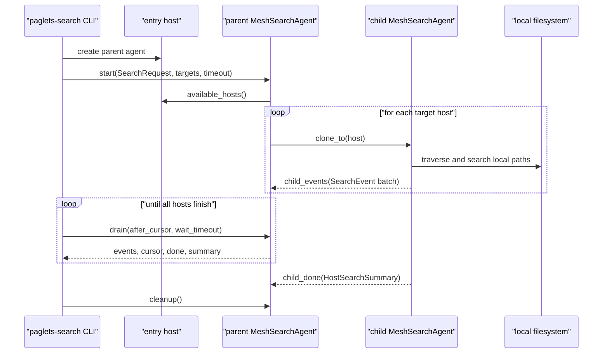
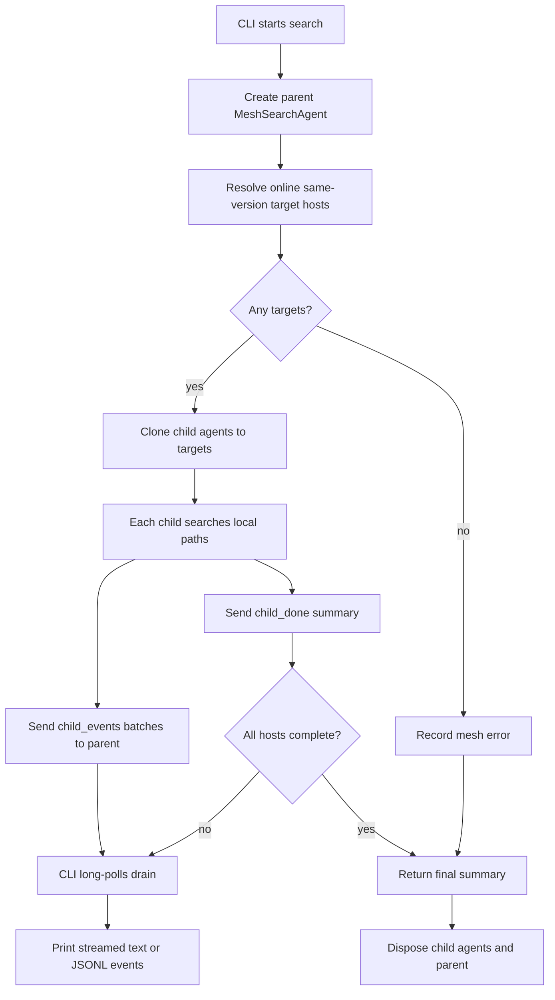

# Mesh Search

`paglets-search` demonstrates a practical mobile-agent use case: move the
search logic to each host, scan local files there, and send only hits back to
the caller. This avoids repeatedly pulling remote file contents to one machine
and gives the caller incremental results while hosts are still scanning.

The core agent is:

```python
from paglets.examples.search import MeshSearchAgent
```

It is a pure mobile agent, not a resident service. The CLI creates one parent
`MeshSearchAgent` on the entry host. The parent clones child agents to target
hosts, children search local paths, and search events travel back to the parent.
The public parent protocol uses typed operations; `MeshFanoutMixin` handles the
clone bookkeeping and `CursorDrainMixin` handles event cursors.

The command combines common `ripgrep` content search and `fd` filename search
features:

```bash
uv run paglets-search grep TODO .
uv run paglets-search grep -C 2 -t py "class .*Agent" src tests
uv run paglets-search grep -i --hidden -g "*.md" paglets docs
uv run paglets-search find README .
uv run paglets-search find report --extension md --kind file
uv run paglets-search --jsonl grep TODO .
```

By default the CLI dynamically discovers a reachable entry host, then the
parent search paglet clones to all online same-version mesh hosts, including
the entry host. Restrict the search to specific hosts with repeated `--host`
flags:

```bash
uv run paglets-search --host alpha --host beta grep TODO /srv/app
```

Paths are interpreted locally by each target host process. Searching `.` means
the current working directory of each host, not the directory where the CLI is
running.

### Agent API

The search example exports the agent, state, request, event, and summary
dataclasses:

```python
from paglets.examples.search import (
    HostSearchSummary,
    MeshSearchAgent,
    MeshSearchState,
    SearchEvent,
    SearchRequest,
)
```

`SearchRequest` is the serializable command surface. It covers two modes:

| Mode | Purpose |
| --- | --- |
| `grep` | Search file contents and emit match, context, count, or file events. |
| `find` | Search file, directory, or symlink names and emit file events. |

`SearchEvent` is the streamed event type. Match events include host, path, line
number, column, full line text, matching text, and match offsets for optional
highlighting. Context events carry neighboring lines. File and count events are
used for filename search, `-l`, `--files-without-match`, and `-c`.

`HostSearchSummary` records per-host totals such as scanned files, matched
files, match counts, path counts, errors, truncation, and duration. The parent
agent's final summary groups these host summaries under `results` and records
host-level failures under `errors`.

### Streaming Flow

The search agent uses message delivery rather than polling a remote filesystem:

1. The CLI creates one parent `MeshSearchAgent` on the entry host.
2. The parent discovers target hosts and clones child agents to them.
3. Each child traverses local paths with Python APIs and sends hit batches back
   to the parent as paglet messages.
4. The parent appends events to state and wakes any `drain` call waiting for new
   events.
5. The CLI long-polls `drain`, printing events as soon as they arrive.

Inside a host, incoming paglet messages already invoke `handle_message()`
through the mailbox. There is no need for a paglet to busy-poll its mailbox.
The search parent uses `wait_state()` so a `drain` request sleeps efficiently
until a child message adds more events, all hosts finish, or the timeout elapses.
This start/drain shape is important because active paglets process one message
at a time in their child process. A parent message handler should not block
waiting for child result messages that must be delivered to that same parent.

The parent exposes these typed operations:

| Operation | Purpose |
| --- | --- |
| `start` | Store the `SearchRequest`, resolve targets, clone children, and return target metadata. |
| `child_events` | Append streamed hit events from a child and wake waiting drain calls. |
| `child_done` | Record the child host summary or host error and mark the host complete. |
| `drain` | Long-poll for events after a cursor, returning immediately when new events arrive. |
| `summary` | Return current aggregate state. |
| `cleanup` | Dispose child agents after the CLI has finished. |

### Flow Diagrams

The below Mermaid `sequenceDiagram` explains the calling sequence
between the CLI, entry host, parent search paglet, child paglets, and local
filesystems:



The following Mermaid `flowchart` explains the parent and child program
flow without focusing on every individual call:



### Search Options

Useful content-search options:

| Option | Meaning |
| --- | --- |
| `-i`, `-S` | Ignore case, or use smart case. |
| `-F` | Treat the pattern as a literal string. |
| `-w` | Match whole words. |
| `-A`, `-B`, `-C` | Include context lines around matches. |
| `-o` | Print only matching text. |
| `-c` | Print matching-line counts per file. |
| `-l`, `--files-without-match` | Print only matching or non-matching file paths. |
| `-g` | Include or exclude glob patterns; prefix with `!` to exclude. |
| `-t`, `-T` | Include or exclude supported file types. |
| `--hidden`, `--no-ignore`, `--follow` | Control hidden paths, ignore files, and symlinks. |
| `--max-depth`, `--max-file-size`, `--max-results-per-host` | Bound local work. |

Useful filename-search options:

| Option | Meaning |
| --- | --- |
| `--full-path` | Match against the full path instead of only the basename. |
| `-e`, `--extension` | Limit results to one extension; repeatable. |
| `--kind` | Emit only `file`, `dir`, `symlink`, or `any` paths. |

The implementation is intentionally a practical subset, not a byte-for-byte
clone of `ripgrep` or `fd`. Use `paglets-search --help`,
`paglets-search grep --help`, `paglets-search find --help`, and
`paglets-search --type-list` for the supported command surface.

### Programmatic Use

Most users should use `paglets-search`, but other paglets can create the search
agent directly and drain streamed events:

```python
from paglets.examples.search import (
    SEARCH_CLEANUP,
    SEARCH_DRAIN,
    SEARCH_START,
    MeshSearchAgent,
    SearchDrainRequest,
    SearchRequest,
    SearchStartRequest,
)
from paglets.patterns.operations import OperationClient
from paglets.serialization.codec import dataclass_to_wire

proxy = self.context.create_paglet(MeshSearchAgent)
client = OperationClient(proxy)
client.call(
    SEARCH_START,
    SearchStartRequest(
        request=dataclass_to_wire(SearchRequest(mode="grep", pattern="TODO", paths=["."])),
        timeout=60.0,
    )
)

cursor = 0
while True:
    reply = client.call(SEARCH_DRAIN, SearchDrainRequest(after_cursor=cursor, wait_timeout=0.5, limit=100))
    for event in reply.events:
        cursor = max(cursor, int(event["cursor"]))
        # Render or forward the event here.
    if reply.done:
        break

summary = reply.summary
client.call(SEARCH_CLEANUP)
proxy.dispose()
```
