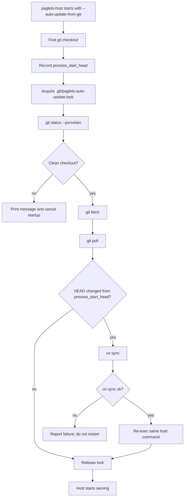
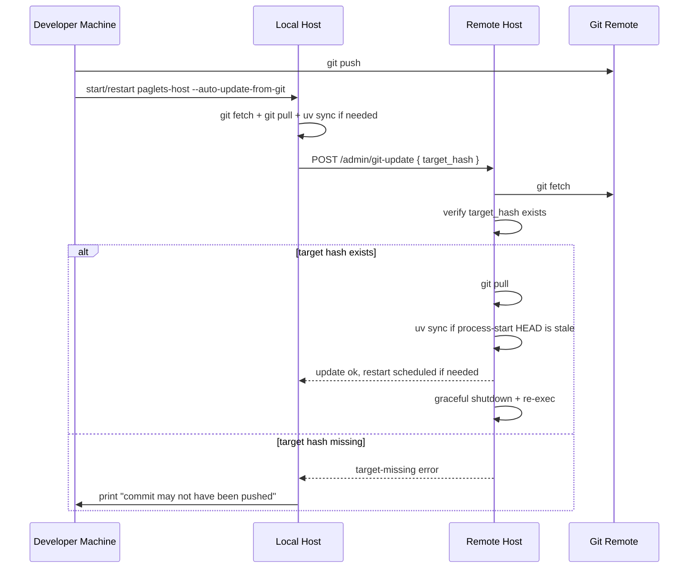
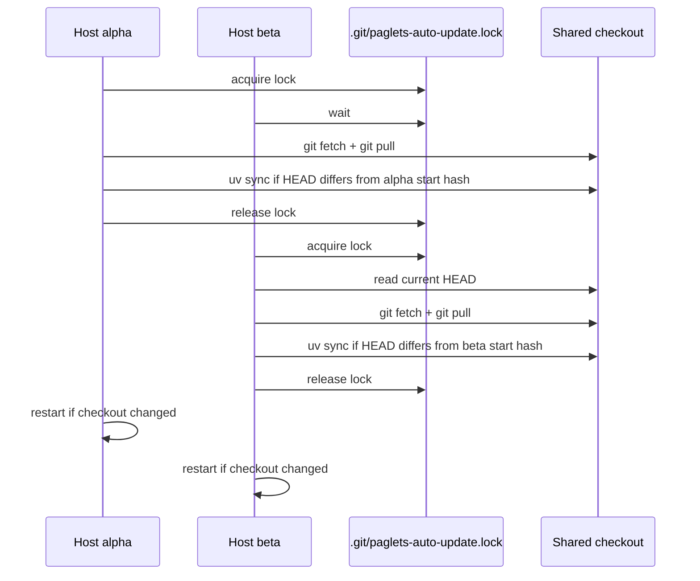

# Git Auto-Update

`paglets-host --auto-update-from-git` keeps trusted paglets hosts aligned with a
git checkout. It is intended for small lab meshes where you develop on one
machine, push commits, and want remote hosts to update and restart without
logging into each machine.

The feature is host-side only. Client commands such as `paglets-pi-compute`,
`paglets-sysinfo`, and `paglets-search` do not need extra flags.

!!! warning "Trusted networks only"
    The update endpoint is unauthenticated and runs `git fetch`, `git pull`, and
    `uv sync`. Use it only on trusted local or lab networks.

## Quick Start

Start every participating host from a git checkout and include
`--auto-update-from-git`:

```bash
uv run paglets-host --name alpha --port 8765 --auto-update-from-git
uv run paglets-host --name beta --port 8766 --peer http://127.0.0.1:8765 --auto-update-from-git
```

Across machines, add `--bind-public [IP]` so each host binds only a reachable
LAN address and publishes that URL to the mesh:

```bash
uv run paglets-host --name mac --bind-public --port 8765 --auto-update-from-git
uv run paglets-host --name windows --bind-public [IP] --port 8765 --auto-update-from-git
```

Repeat `--bind-public IP` to listen on multiple specific addresses. The first
bound address is the one published to mesh peers. The auto form keeps watching
for LAN address changes and rebinds/publishes the new address after DHCP or
network reconnect changes it.

The checkout must be clean. If `git status --porcelain` reports uncommitted or
untracked files, startup is cancelled before any fetch or pull runs:

```text
paglets-host: --auto-update-from-git requires a clean git checkout; startup cancelled.
```

The normal workflow is:

1. Commit locally.
2. Push the commit.
3. Start or restart one local paglets host with `--auto-update-from-git`.
4. That host advertises its commit to configured peers and known mesh hosts.
5. Remote hosts fetch, pull, run `uv sync`, and restart themselves if needed.

## Startup Flow

On startup, a host records the commit hash that the current Python process
started from. It then serializes git and dependency operations through a lock
inside the checkout.



The lock path is `.git/paglets-auto-update.lock`. It prevents multiple paglets
host processes that share one checkout from running `git pull` or `uv sync`
concurrently.

## Mesh Broadcast Flow

After startup, an auto-update-enabled host sends its current commit hash to
configured `--peer` URLs and known mesh host URLs. Normal mesh membership still
uses the existing code-version gate, so mismatched peers are not selected for
dispatch or clone. The update request is separate from normal mesh membership.



If a remote host reports that the requested commit is missing after `git fetch`,
the requesting host prints the error. In practice this usually means the local
commit was not pushed yet. Run `git push`, then restart the local/requesting
host to broadcast the commit again.

## Shared Checkout Behavior

Multiple hosts may run from the same project folder, for example several local
host processes on different ports. They all share one checkout lock.



The second host still restarts when the shared checkout already moved before it
got the lock. Restart decisions compare the current checkout `HEAD` with each
process's own `process_start_head`, not only with whether that process ran a
successful pull.

## Runtime API

Participating hosts expose update metadata in `/health`:

```json
{
  "auto_update_from_git": true,
  "git_head": "012345...",
  "git_process_start_head": "012345...",
  "git_update": {
    "status": "current",
    "ok": true,
    "target_hash": "012345..."
  }
}
```

The update endpoint is:

```http
POST /admin/git-update
```

Request payload:

```json
{
  "target_hash": "012345...",
  "source_name": "alpha",
  "source_url": "http://127.0.0.1:8765"
}
```

Important statuses:

- `disabled`: the host was not started with `--auto-update-from-git`.
- `dirty-worktree`: local changes are present; no fetch, pull, sync, or restart
  is attempted.
- `target-missing`: the requested commit was not found after `git fetch`.
- `pull-failed`: `git pull` failed, often because of conflicts or local git
  configuration.
- `uv-sync-failed`: code updated, but dependency sync failed; restart is not
  scheduled.
- `current`: the checkout is already at the process's start hash.
- `updated`: the checkout changed and restart may be scheduled.

The latest update result is kept in memory and returned from `/health`, so the
requesting host can report remote failures without logging into the remote
machine.

## Operational Notes

- Start hosts from the repository root or any path inside the repository.
- The checkout must have a usable upstream remote for `git fetch` and `git pull`.
- Commit or stash local edits before enabling auto-update.
- Push commits before broadcasting them to other hosts.
- Keep `uv` installed on hosts; dependency sync uses `uv sync`.
- Use a process supervisor only if you want extra resilience. The default
  behavior is self re-exec with the same command-line arguments.
