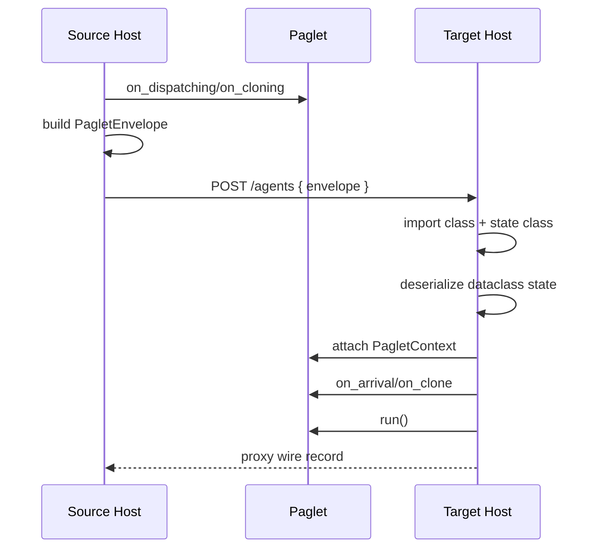
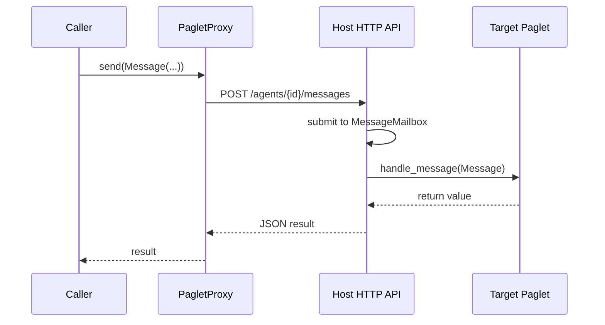

# Internal Workings

This page describes how the codebase fits together.

## Runtime Model

Paglets move as a transfer envelope:

1. The source host finds the live paglet.
2. The host serializes the paglet's dataclass state.
3. The host records the paglet class name and state class name.
4. The target host imports those classes by name.
5. The target host reconstructs the paglet and attaches a fresh context.
6. The target host invokes the appropriate lifecycle hook and then `run()`.

The runtime does not move Python call stacks, threads, sockets, local file
handles, or arbitrary instance attributes.

## Main Modules

`paglets.agent`
: Defines `PagletState`, `PagletContext`, `Paglet`, lifecycle hooks, and
  convenience methods such as `dispatch`, `clone`, `send`, `multicast`,
  `available_hosts`, `dispatch_to`, and `clone_to`.

`paglets.host`
: Hosts paglets in memory and exposes the JSON HTTP API. It owns active paglets,
  durable inactive records, host properties, mesh state, and lifecycle
  operations.

`paglets.proxy`
: Defines `PagletProxy`, the controlled handle used to inspect, message, move,
  deactivate, activate, or dispose a paglet.

`paglets.messages`
: Defines `Message`, `FutureReply`, and `ReplySet`.

`paglets.envelope`
: Defines `PagletEnvelope`, the serialized transfer record used for dispatch,
  clone, retract, and activation.

`paglets.persistency`
: Defines `DeactivationPolicy`, `DeactivationRequest`, and the durable inactive
  record format used by host storage.

`paglets.mesh`
: Defines `HostRef` and `MeshRegistry`, including version-gated peer discovery,
  seed-list gossip, multicast beacons, online/offline status, and host-name
  resolution.

`paglets.admin`
: Provides a reusable client layer for multi-server administration and TUI
  configuration.

`paglets.discovery`
: Implements local TUI-side discovery of importable `Paglet` subclasses.

`paglets.tui`
: Provides the optional Textual admin console.

## Movement Flow



For dispatch and retract, the source host removes the original after successful
delivery. For clone, the source host keeps the original and the target receives a
new agent ID.

## Messaging Flow



Message arguments and replies should be JSON-compatible. Normal messages enter
the per-paglet mailbox, where queued work is ordered by priority and FIFO
within one priority. `UNQUEUED_PRIORITY` bypasses the queue for explicit
immediate delivery.

## Host HTTP API

The host API is intentionally small:

- `GET /health`
- `GET /hosts`
- `POST /hosts/join`
- `GET /events?since=<id>&limit=<n>`
- `GET /services`
- `GET /agents?state=active|inactive|all`
- `POST /agents`
- `GET /agents/{id}`
- `GET /agents/{id}/state`
- `POST /agents/{id}/messages`
- `POST /agents/{id}/dispatch`
- `POST /agents/{id}/clone`
- `POST /agents/{id}/retract`
- `POST /agents/{id}/deactivate`
- `POST /agents/{id}/activate`
- `POST /agents/{id}/dispose`
- `POST /agents/{id}/services`
- `POST /agents/{id}/unadvertise-service`

There is no authentication layer in this first runtime.

## Launch Config And Autostart

`paglets-host` loads `~/.paglets/launch.toml` by default. On first start it
copies the bundled demo launch config, which starts the packaged example
`server-info` service:

```toml
[[startup_agents]]
class = "paglets.examples.system_info.agent:ServerInfoAgent"
agent_id = "service.server-info"
singleton = true
state = { service_scope = "mesh" }
```

If a later package version includes a different bundled demo config version,
interactive starts ask before replacing the user file. The previous file is
moved to `launch.toml.old` or a timestamped `.old-*` path. Non-interactive
starts never block; they keep the existing file and print a warning. Operators
can use `--yes`, `--no-sync-launch-config`, or set `sync_demo_config = false`
in `[launch]`.

Startup agents run after the HTTP server is bound and durable startup records
are activated, but before mesh gossip starts. Singleton entries with a fixed
agent ID skip an already active paglet and activate an inactive matching record
instead of creating a duplicate.

## Durable Inactive Records

Deactivation serializes a paglet into an inactive record and removes the live
object from memory. The default CLI location is:

```text
~/.paglets/hosts/{host-name}/inactive/{agent-id}.json
```

Each record contains the `PagletEnvelope`, the chosen `DeactivationPolicy`, the
deactivation request metadata, and any messages queued while the paglet is
inactive. Records are written with an atomic replace.

Activation removes the record, reconstructs the paglet from class path and
dataclass state, calls `on_activation`, invokes `run()`, and then drains queued
messages. If activation fails, the inactive record is restored.

Messages sent to inactive paglets use the stored policy:

- `activate_on_message=True` activates and delivers immediately.
- `activate_on_message=False` with queueing enabled stores the message and
  returns a queued acknowledgement.
- `no_delay=True` fails fast when the paglet cannot be activated for that
  message.

## Mesh Registry

Every host has a `MeshRegistry`. The registry contains the host itself and
same-version peers discovered through:

- configured seed peers from `--peer`;
- periodic gossip through `/hosts/join`;
- optional UDP multicast beacons.

`HostRef.code_version` gates visibility. A host with a different code version is
ignored by the registry. This keeps name-based dispatch and clone helpers from
selecting hosts that are likely running incompatible code.

## TUI And Admin Client

The TUI is a client, not a host. It reads a local config file, polls configured
hosts, displays health/agent/mesh status, and sends admin operations through the
same HTTP API a normal client would use.

The TUI-side class discovery feature scans local paths/modules for importable
`Paglet` subclasses. It is a convenience for filling create forms; it does not
upload code to servers or mutate remote import paths.
