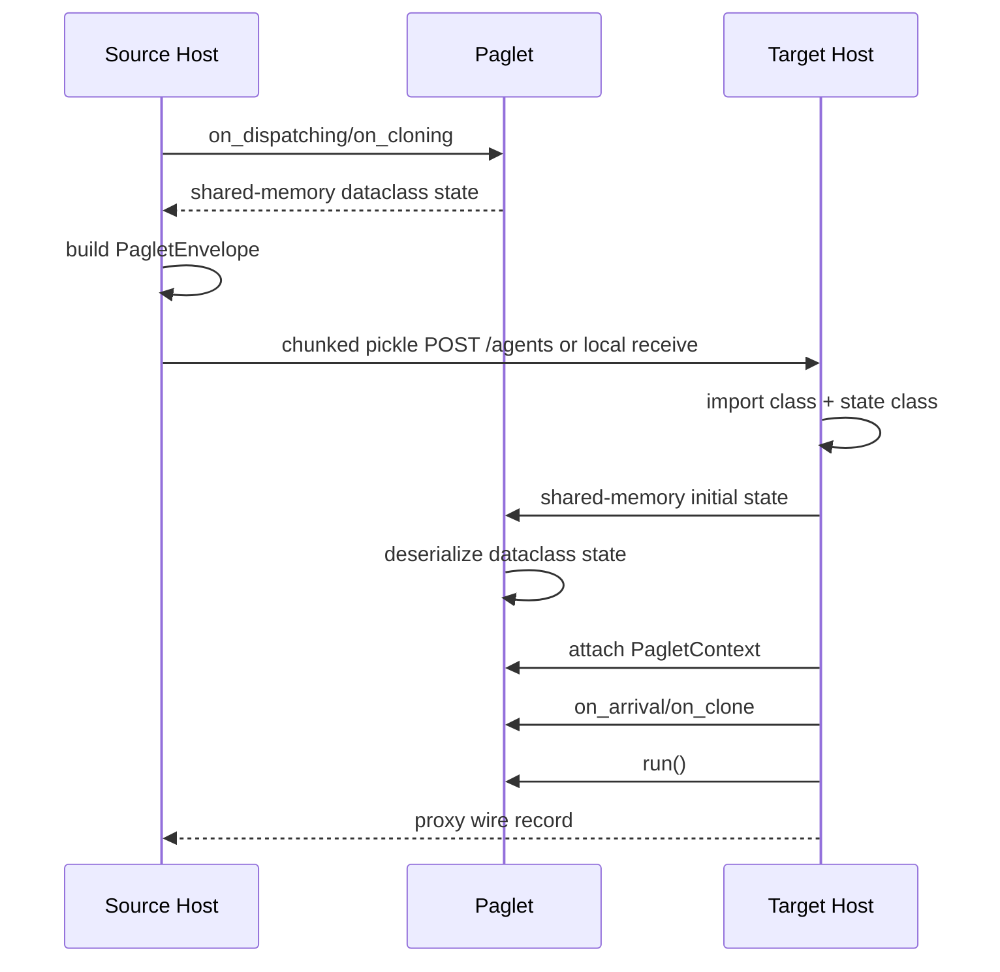
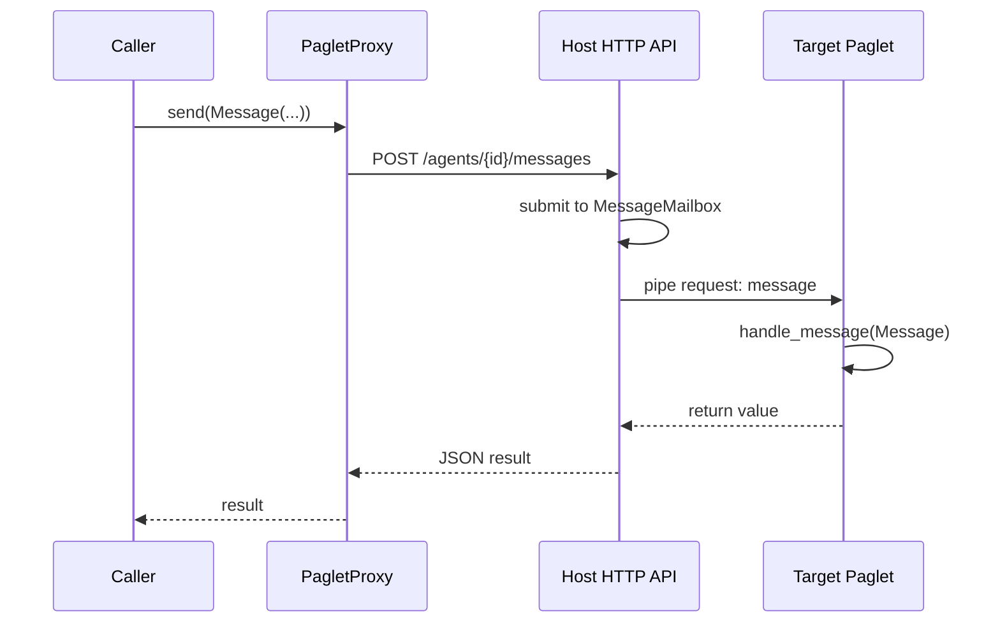

# Internal Workings

This page describes how the codebase fits together.

## Runtime Model

Paglets move as a transfer envelope:

1. The source host finds the active child-process record.
2. The host asks the child for fresh dataclass state over a one-shot
   shared-memory pickle stream.
3. The host records the paglet class name and state class name.
4. The source host posts the envelope to the target with chunked pickle HTTP,
   or directly receives it locally when the target is the same host.
5. The target host imports those classes by name.
6. The target host streams the initial state into a fresh child process through
   shared memory.
7. The child reconstructs the paglet and attaches a fresh context.
8. The target host invokes the appropriate lifecycle hook and then `run()`.

The runtime does not move Python call stacks, threads, sockets, local file
handles, or arbitrary instance attributes.

## Main Modules

`paglets.agent`
: Defines `PagletState`, `PagletContext`, `Paglet`, lifecycle hooks, and
  convenience methods such as `dispatch`, `clone`, `send`, `multicast`,
  `available_hosts`, `dispatch_to`, and `clone_to`.

`paglets.host`
: Supervises active paglet child processes and exposes the JSON HTTP API. It
  owns durable inactive records, host properties, mesh state, service records,
  storage, placement, and lifecycle operations.

`paglets.process_runtime`
: Implements the parent/child process protocol for active paglets. The parent
  starts children with `multiprocessing.get_context("spawn")`, talks to each
  child over a private `Pipe`, routes child host calls back to `Host`, and
  caches the latest serialized state. Large state payloads cross this boundary
  through one-shot shared-memory pickle streams; the pipe carries only control
  metadata.

`paglets.transport`
: Provides the internal streamed pickle transport helpers for host-to-host HTTP
  movement and shared-memory local host/child process state handoff.

`paglets.proxy`
: Defines `PagletProxy`, the controlled handle used to inspect, message, move,
  deactivate, activate, or dispose a paglet.

`paglets.messages`
: Defines `Message`, `FutureReply`, and `ReplySet`.

`paglets.envelope`
: Defines `PagletEnvelope`, the serialized transfer record used for dispatch,
  clone, retract, and activation.

`paglets.persistency`
: Defines `DeactivationPolicy`, `DeactivationRequest`, and the durable inactive
  record format used by host storage.

`paglets.mesh`
: Defines `HostRef` and `MeshRegistry`, including version-gated peer discovery,
  dynamic LAN discovery, multicast beacons, online/offline status, and
  host-name resolution.

`paglets.admin`
: Provides dynamic entry-host discovery and a reusable client layer for HTTP
  administration.

`paglets.discovery`
: Implements local discovery of importable `Paglet` subclasses for tooling.

## Movement Flow



For dispatch and retract, the source host removes the original after successful
delivery. For clone, the source host keeps the original and the target receives a
new agent ID.

## Local Transport Paths

There are two local cases that are easy to confuse:

- Same host runtime: the target URL is this host's own published address.
  Dispatch, clone, and retract skip HTTP/TCP and hand the `PagletEnvelope`
  directly to the same `Host` instance. The receiving side still starts a fresh
  child process for the arriving paglet, so lifecycle behavior matches a normal
  move.
- Same machine, different host processes: two hosts on `127.0.0.1` with
  different ports are separate runtimes. Movement between them still uses the
  chunked pickle `POST /agents` path, just over loopback TCP.

Shared memory is used for the parent/child process boundary inside one host,
not as a general replacement for host-to-host transport. When a child starts,
when the host snapshots active state, or when a child asks the host to complete
create, dispatch, clone, deactivate, or dispose, the dataclass state is pickled
into one-shot `multiprocessing.shared_memory` segments. The pipe message carries
only control metadata plus the shared-memory segment names, sizes, and token.
The receiver unpickles from those segments, unlinks them, and acknowledges the
token so the sender can release its handles.

## Messaging Flow



Message arguments and replies should be JSON-compatible. Normal messages enter
the per-paglet host mailbox, where queued work is ordered by priority and FIFO
within one priority. The mailbox submits at most one normal message to a child
at a time. `UNQUEUED_PRIORITY` bypasses the queue on the host side, but the
child runtime still processes lifecycle/message commands serially.

Child processes can also send host calls over the same pipe. These calls cover
context operations such as service lookup, storage reads and writes, remote
paglet creation, dispatch, clone, deactivate, dispose, mesh status, and event
emission. When these calls include large state payloads, the state travels
through the local shared-memory stream described above. Ordinary `Message`
arguments and replies stay on the normal control path and should remain
JSON-compatible. No extra TCP or UDP ports are opened for parent/child IPC.

## State And Handler Concurrency

Each active paglet owns a reentrant lock. `Paglet.locked_state()` yields the
dataclass state under that lock, `Paglet.locked()` protects any agent-local
critical section, and `@state_locked` wraps short helper methods. The host also
uses the paglet lock when it serializes active state for transfer envelopes and
state inspection.

The child runtime processes one lifecycle or message command at a time. A
handler that waits for later `child_result` messages would block those messages,
so distributed parent/worker paglets should return after launching work and
expose a `drain` or `summary` message that callers can poll. Long-running local
work should run in a background thread or a separate worker paglet. The intended
state pattern is still to copy or update shared state in short locked sections,
then release the lock before sleeping, doing I/O, or calling remote proxies.

`Paglet.MAILBOX_WORKERS` is ignored by the process runtime. Parallelism is
achieved by creating multiple paglet instances, which gives each active instance
its own Python process. Background threads inside one paglet process are outside
message scheduling, so explicit state locking is still required when they share
mutable state with message handlers.

## Process Isolation

Every active paglet is constructed in a child Python process. The process title
and `multiprocessing.Process.name` use:

```text
paglet:{host_name}:{short_class_name}:{agent_id}
```

The host does not catch `BaseException` from paglet code as a recoverable
handler error. Normal `Exception` subclasses are returned as message errors and
the child remains alive. `SystemExit`, `KeyboardInterrupt`, `os._exit`, native
crashes, and process termination close the pipe; the parent marks the paglet
crashed, removes its active service records, fails pending messages with
`PagletCrashedError`, and keeps the last cached state visible through state
endpoints until the paglet is disposed.

Because `spawn` re-imports classes in the child, paglet classes and their state
classes must live in importable modules. Script-local or REPL classes under
`__main__` are rejected during creation or transfer.

The benefits are isolation and true process-level CPU parallelism. A paglet can
call `sys.exit()`, crash native code, or spin a CPU core without directly
terminating the host process or unrelated paglets. Multiple worker paglets on
one host can run on multiple cores because they are separate Python processes.

The costs are stricter importability and more overhead. Creating a paglet now
starts a process and establishes IPC, so very small tasks should be batched.
Paglet instance attributes remain process-local and transient. A parent paglet
cannot synchronously wait inside one message handler for result messages that
must be delivered back to that same parent; collectors should use the
start/drain pattern described in the examples.

## Host HTTP API

The host API is intentionally small:

- `GET /health`
- `GET /hosts`
- `POST /hosts/join`
- `GET /events?since=<id>&limit=<n>`
- `GET /services`
- `POST /services/leases`
- `POST /services/leases/{lease-id}/release`
- `GET /agents?state=active|inactive|all`
- `POST /agents`
- `GET /agents/{id}`
- `GET /agents/{id}/state`
- `POST /agents/{id}/messages`
- `POST /agents/{id}/dispatch`
- `POST /agents/{id}/clone`
- `POST /agents/{id}/retract`
- `POST /agents/{id}/deactivate`
- `POST /agents/{id}/activate`
- `POST /agents/{id}/dispose`
- `POST /agents/{id}/services`
- `POST /agents/{id}/unadvertise-service`

There is no authentication layer in this first runtime.

## Launch Config, Autostart, And Resident Services

`paglets-host` loads `~/.paglets/launch.toml` by default. On first start it
copies the bundled demo launch config, which declares the packaged example
`server-info` service as a lazy managed resident service and `mesh-info` as an
eager resident service:

```toml
[[resident_services]]
class = "paglets.examples.system_info.agent:ServerInfoAgent"
enabled = true
agent_id = "service.server-info"
singleton = true
lifecycle = "lazy"
scope = "mesh"
idle_timeout = 30.0
state = { service_scope = "mesh" }

[[resident_services]]
class = "paglets.examples.mesh_info.agent:MeshInfoAgent"
enabled = true
agent_id = "service.mesh-info"
singleton = true
lifecycle = "eager"
scope = "mesh"
idle_timeout = 0.0
state = { service_scope = "mesh" }
```

Launch config is an external TOML format, so lifecycle and scope values are
stored as strings. The loader converts them to `ResidentLifecycle` and
`ServiceScope` enum values before runtime code sees them. Python APIs require
the enum values directly.

If a later package version includes a different bundled demo config version,
interactive starts ask before replacing the user file. The previous file is
moved to `launch.toml.old` or a timestamped `.old-*` path. Non-interactive
starts never block; they keep the existing file and print a warning. Operators
can use `--yes`, `--no-sync-launch-config`, or set `sync_demo_config = false`
in `[launch]`.

`startup_agents` are ordinary always-started agents. They run after the HTTP
server is bound and durable startup records are activated, but before mesh
gossip starts. Singleton entries with a fixed agent ID skip an already active
paglet and activate an inactive matching record instead of creating a duplicate.

`resident_services` are managed service declarations. Lazy resident services
are registered in the service registry at host start without constructing the
provider paglet. First message delivery to the service agent ID creates or
activates the provider, then routes the message normally. Eager resident
services use the same declaration format with `lifecycle = "eager"` and are
activated immediately.

The host tracks in-flight calls, TTL-backed service leases, and last-used time
for managed services. A lazy active provider is deactivated after
`idle_timeout` when there are no in-flight calls and no active leases. The
managed service record stays discoverable, so a later call can activate it
again.

## Managed Storage

Hosts own two filesystem areas below their persistence root:

```text
~/.paglets/hosts/{host-name}/work/{agent-id}
~/.paglets/hosts/{host-name}/storage/{class-key}
```

The `work` tree is per active paglet instance. It is cleared on host startup,
and a source instance's work directory is cleared on dispatch, retract, or
dispose. Deactivation keeps work while the same host runtime remains up, but a
restart clears it.

The `storage` tree is per paglet class and survives restart, deactivation,
dispatch, and dispose. `ManagedStorage` resolves all API paths under its root
and enforces the configured quota before writes. The runtime cannot prevent
arbitrary direct filesystem writes by user code, so quota enforcement applies
to writes performed through the managed storage API.

## Durable Inactive Records

Deactivation serializes a paglet into an inactive record and stops the active
child process. The default CLI location is:

```text
~/.paglets/hosts/{host-name}/inactive/{agent-id}.json
```

Each record contains the `PagletEnvelope`, the chosen `DeactivationPolicy`, the
deactivation request metadata, and any messages queued while the paglet is
inactive. Records are written with an atomic replace.

Activation removes the record, reconstructs the paglet from class path and
dataclass state, calls `on_activation`, invokes `run()`, and then drains queued
messages. If activation fails, the inactive record is restored.

Messages sent to inactive paglets use the stored policy:

- `activate_on_message=True` activates and delivers immediately.
- `activate_on_message=False` with queueing enabled stores the message and
  returns a queued acknowledgement.
- `no_delay=True` fails fast when the paglet cannot be activated for that
  message.

## Mesh Registry

Every host has a `MeshRegistry`. The registry contains the host itself and
same-version peers discovered through:

- configured seed peers from `--peer`;
- periodic gossip through `/hosts/join`;
- optional UDP multicast beacons.

`HostRef.code_version` gates visibility. A host with a different code version is
ignored by the registry. This keeps name-based dispatch and clone helpers from
selecting hosts that are likely running incompatible code.

## Git Auto-Update

`paglets-host --auto-update-from-git` is documented in detail in
[Git Auto-Update](git-auto-update.md). Internally, the host records its
process-start git hash, serializes `git status`, `git fetch`, `git pull`, and
`uv sync` through `.git/paglets-auto-update.lock`, stores the latest update
result in `/health`, and exposes `POST /admin/git-update` only for opted-in
hosts. Normal mesh version gating still protects dispatch and clone selection;
the update endpoint is a separate trusted-network maintenance path.

## Admin Client

The admin client is a normal HTTP client, not a host. It works with discovered
entry hosts and sends admin operations through the same HTTP API used by
proxies and examples. Mesh membership is not loaded from a saved IP list.

The local class discovery helper scans paths/modules for importable `Paglet`
subclasses. It is a tooling convenience only; it does not upload code to
servers or mutate remote import paths.
