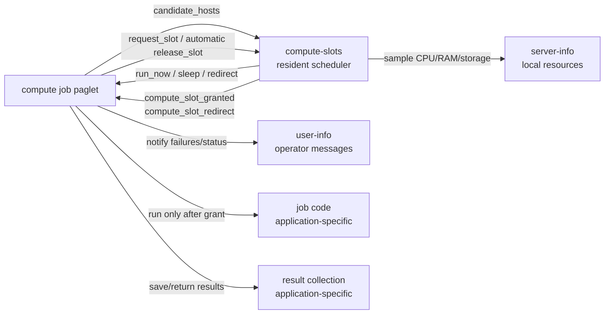
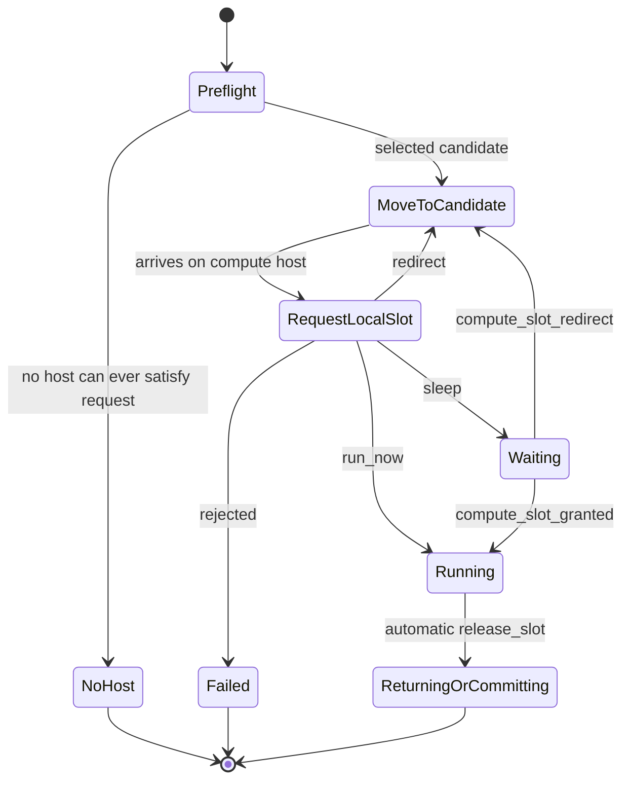
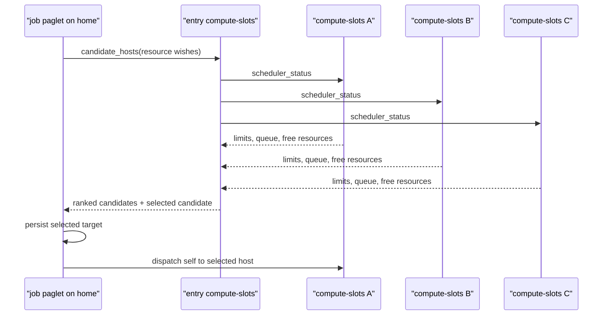
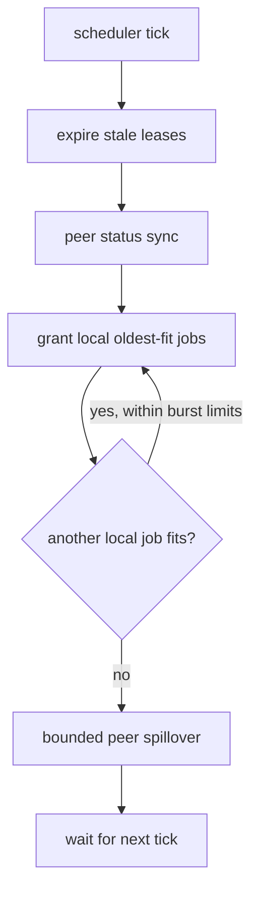
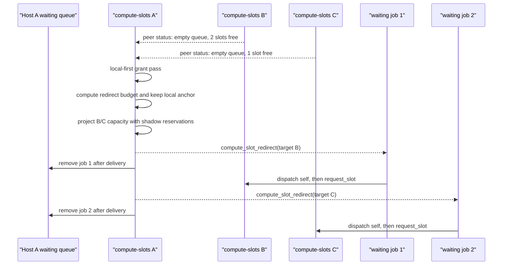

# Compute Slots

`compute-slots` is a built-in resident scheduler service for coarse compute
jobs. It is designed for paglets that know their own resource needs and can wait
until a host has enough capacity to run them.

The service does not run the job code. It admits, queues, redirects, and grants
compute slots. `ComputeJobPaglet` owns the scheduling protocol and lease release
for normal compute jobs. The job paglet remains responsible for downloading
input, performing work, storing intermediate results, and deciding where to
return results.

The [Analysis Jobs example](../examples/analysis-jobs.md) shows one complete
consumer implementation.

## Writing A Compute Job

New compute job types should not copy the scheduler protocol by hand. Use the
client-side base layer from `paglets.system.compute_slots`. The base class owns
placement, slot requests, sleep/wakeup, redirects, failure defaults, automatic
home-host capture, and automatic lease release.

Minimal skeleton:

```python
from dataclasses import dataclass

from paglets.system.compute_slots import ComputeJobPaglet, ComputeJobState


@dataclass
class MyJobState(ComputeJobState):
    cpu_cores: int = 1
    memory_bytes: int = 512 * 1024 * 1024
    temp_storage_bytes: int = 0
    estimated_runtime_seconds: float = 120.0
    dataset_name: str = ""
    result_path: str = ""


class MyJobPaglet(ComputeJobPaglet[MyJobState]):
    State = MyJobState

    def run_compute_job(self) -> None:
        # Do CPU/RAM/temp-storage work here. The base class releases the slot.
        with self.locked_state() as state:
            state.result_path = "..."

    def continue_after_compute_success(self) -> None:
        # Return, upload, or commit results here. This can run again after wakeup.
        pass

    def after_compute_failure(self, message: str) -> None:
        self.notify_user("error", "Compute job failed", message)
```

Resource estimates are validated before the first scheduler call:

- `cpu_cores` must be at least `1`.
- `memory_bytes` must be greater than `0` unless
  `allow_zero_memory_bytes = True`.
- `estimated_runtime_seconds` must be greater than `0` unless
  `allow_zero_runtime_seconds = True`.
- `temp_storage_bytes` may be `0`, but should be realistic when scratch space is
  required.

Use application fields, such as `dataset_name`, `sample_id`, `job_id`, or
`result_key`, for domain-specific result labels. The scheduler derives its own
internal diagnostic label from the runtime `agent_id`; normal job code does not
set or use that label.

| Field or hook                                                    | Owner       | Purpose                                              |
| ---------------------------------------------------------------- | ----------- | ---------------------------------------------------- |
| `compute_status`, `compute_error`                                | Base class  | Scheduler and slot lifecycle.                        |
| `slot_request_id`, `slot_lease_id`, redirects, affinity metadata | Base class  | Internal scheduler protocol state.                   |
| `status`, `result_path`, domain IDs                              | Application | Result lifecycle and business state.                 |
| `run_compute_job()`                                              | Application | The actual work after a slot grant.                  |
| `continue_after_compute_success()`                               | Application | Result return/commit logic, including later wakeups. |
| `after_compute_failure(message)`                                 | Application | Optional notification or cleanup.                    |

`after_compute_success()` is a one-shot hook called immediately after
`run_compute_job()` returns and the lease is released. Its default implementation
calls `continue_after_compute_success()`. If a completed job deactivates and
wakes later, only `continue_after_compute_success()` is called again.

`notify_user()` is non-fatal. It suppresses notification transport failures and
returns `False` when delivery failed.

## Job Groups And Collectors

For a submitter-plus-collector workflow, use the group helpers instead of
hand-rolling the same registration and status bookkeeping in every
application:

```python
from paglets.system.compute_slots import (
    CollectingComputeJobPaglet,
    CollectingComputeJobState,
    ResultCollectorPaglet,
    submit_compute_job_group,
)
```

`submit_compute_job_group(...)` creates a collector, registers expected job
keys before workers start, creates the compute jobs, and records creation
failures back into the collector. `ResultCollectorPaglet` accepts `job_result`
and `job_failure` reports, exposes `summary` and `drain`, tracks duplicates,
and can optionally return to the submitter/home host when the group completes.

The group layer is intentionally small. It tracks job completion and result
reports; it does not add a durable global queue. Use
`report_compute_artifact(...)` from `run_compute_job()` when a result is a
file. That helper reports success itself, so do not also call
`report_compute_success(...)` for the same job. See
[Artifact Transport](artifacts.md) for natural file mobility and low-level
artifact APIs.

## Service Role

Each host runs one eager `ComputeSlotsAgent`:

<div class="paglets-code-source">Source: <a href="https://github.com/cklukas/paglets/blob/main/src/paglets/config/defaults/launch.toml">compute-slots service in launch.toml</a></div>

```toml
--8<-- "src/paglets/config/defaults/launch.toml:compute-slots-service"
```

Each scheduler owns only local admission decisions. A job paglet first asks for
candidate hosts while it is still at home. After it chooses a suitable host, the
paglet dispatches there. Only after arrival does it call that host's local
`request_slot` operation and receive `run_now`, `sleep`, `redirect`, or
`rejected`.

Schedulers also exchange peer status with other schedulers. That status
exchange is between scheduler services; it is not the same thing as the job
paglet's local slot request after movement.



The scheduler does not run analysis code, store result frames, dispatch sleeping
paglets directly, or own application retry policy. It admits work, queues work,
grants leases, and recommends redirects. The paglet owns movement, computation,
result storage, and final result collection.

## Compute Paglet Lifecycle

This is the expected lifecycle for any paglet that uses the service:



`request_slot` is always local to the host where the paglet currently lives. A
redirect is only a recommendation plus an activation message. The paglet must
dispatch itself to the target host and request a slot again after arrival.

## Request Model

A paglet submits a `ComputeSlotRequest` with its own resource estimate:

- `agent_id` and `agent_host_url`, so the scheduler can wake or redirect it.
- `job_id`, an internal scheduler diagnostic label derived by the
  `ComputeJobPaglet` base class.
- `cpu_cores`, the requested number of logical CPU cores. This is the
  scheduler's explicit CPU reservation count.
- `memory_bytes`, expected peak RAM pressure.
- `temp_storage_bytes`, expected scratch storage.
- `estimated_runtime_seconds`, used for lease TTLs.
- `requires_gpu` and `gpu_memory_mb`, reserved for GPU scheduling.
- `required_host_tags`, `excluded_host_tags`, and `preferred_host_tags`, for
  role-based placement such as Linux-only or GPU-preferred workers.
- `excluded_host_names` and `excluded_host_urls`, for avoiding the submitter,
  collector, laptop, or any other known host.
- `redirect_count`, `last_redirect_at`, and `last_redirect_from_host_url`, used
  for redirect cooldown and ping-pong avoidance.

GPU fields are part of the schema, but v1 rejects GPU-required jobs because GPU
admission is not implemented yet.

## Scheduling Details

The scheduler uses common coarse-grained scheduling concepts:

- **Work-conserving local admission**: if a queued job can run locally now, the
  local scheduler grants it before considering redirects.
- **Oldest-fit queue scanning**: queued requests are inspected in submission
  order, and the first request that currently fits receives the next lease.
- **Bounded work stealing**: a scheduler with blocked waiting jobs may wake some
  of them and redirect them to a peer with free capacity.
- **Local anchor**: if more than one job is waiting locally, at least one waiting
  job stays behind so the host has work ready when a local lease finishes.
- **Redirect cooldown**: a recently redirected request is not redirected again
  immediately, which adds hysteresis and prevents ping-pong movement.
- **Shadow reservations**: when several jobs are redirected in one pass, the
  scheduler subtracts their estimated resources from projected peer capacity
  before choosing the next redirect.

The defaults are conservative:

| Setting                          |        Default | Meaning                                                                       |
| -------------------------------- | -------------: | ----------------------------------------------------------------------------- |
| `grant_interval`                 | `15.0` seconds | Normal wait between local grants.                                             |
| `max_grants_per_tick`            |            `4` | Hard cap for grants sent during one scheduler pass.                           |
| `burst_load_per_cpu`             |          `0.5` | Maximum load per CPU for burst grants after the first grant.                  |
| `burst_resource_headroom_factor` |          `2.0` | Free CPU/RAM/temp-storage multiplier required for burst grants.               |
| `max_redirects_per_tick`         |            `4` | Hard cap for peer spillover in one scheduler pass.                            |
| `max_redirect_fraction`          |          `0.5` | Redirect at most half of the local queue.                                     |
| `redirect_cooldown_seconds`      |         `60.0` | Minimum time before a request can be redirected again.                        |
| `placement_sample_size`          |            `3` | Initial placement chooses deterministically among the best ranked candidates. |

### CPU Cores, Affinity, And Memory

CPU admission is a discrete logical-core reservation model. A request with
`cpu_cores = 2` reserves two logical CPU cores before the job starts. Free CPU
capacity is computed as:

```text
eligible logical CPU IDs - CPU cores reserved by active leases
```

The sampled load average is still useful, but only as a throttling signal for
burst grants. It is not the primary CPU admission counter. This makes the
maximum number of concurrently admitted jobs explicit and avoids depending on
load average, which rises only after processes have already started.

When the host platform supports process affinity, a granted lease also carries
the current `cpu_core_ids` mask allocated to the job:

- Linux uses `os.sched_setaffinity(0, cpu_core_ids)`.
- Windows uses `psutil.Process().cpu_affinity(cpu_core_ids)`.
- macOS reports affinity as unsupported in v1.

Unsupported affinity does not reject the job. The scheduler still reserves
logical CPU cores, but the reply marks `cpu_affinity_supported = false` and the
job runs without OS-level pinning.

Affinity is host-managed. The compute job paglet does not need to set its own
process mask. `compute-slots` decides the mask and asks the local host process
to apply it to the target paglet child process. The low-level helper remains
available for tests and internal use, but normal compute paglets should treat
affinity as scheduler metadata.

`cpu_cores` is the guaranteed logical-core floor. When fewer jobs are active
than the host can run, the scheduler uses elastic affinity: it keeps each
lease's reserved CPU IDs and spreads idle eligible CPUs across active leases.
For example, on a host with ten eligible CPUs, two active jobs that each
requested two CPU cores keep their two-core reservations but are expanded to
five CPU IDs each. When more jobs start, masks shrink back toward the reserved
floors so the new job can get its guaranteed cores.

Memory admission uses available RAM, not merely free RAM:

```text
psutil.virtual_memory().available - memory reserved by active leases
```

This matters because operating systems often use otherwise idle memory for file
cache. Reclaimable cache should not by itself prevent a job from starting. The
`memory_bytes` field remains an expected peak estimate; v1 does not create
cgroups, Windows Job Objects, or other hard memory limits.

### Initial Placement

Initial placement is a reusable scheduler decision plus a paglet-owned movement:



`candidate_hosts` first filters durable capability mismatches, such as missing
GPU support or too little total RAM. It also skips hosts with current status
errors, but those are treated as transient health problems rather than proof
that the host could never run the job. The remaining hosts are ranked, and the
scheduler provides a deterministic selected candidate from the best few
candidates. The paglet still performs the dispatch itself.

### Local Queue Pass

Each scheduler pass is local-first:



Local grants reserve CPU cores, RAM, and temp storage immediately. That
reservation happens before the operating system load average has time to rise.

### Bounded Spillover Across Three Hosts

When Host A has a blocked queue and Host B or Host C has free capacity, Host A
may redirect more than one waiting paglet. It does not empty its whole queue.



Scenario behavior:

- If Host A has five waiting jobs and Host B has room for three, Host A can
  redirect up to three jobs, subject to the global redirect cap.
- If Host A has five waiting jobs and Host B plus Host C have room for six,
  Host A still keeps at least one local waiting job and obeys
  `max_redirects_per_tick`.
- If Host A has exactly one waiting job and a peer has a fitting free slot, that
  one job may move; otherwise idle peer capacity would remain unused.
- If a waiting job can run on Host A now, Host A grants it locally instead of
  redirecting it.
- If a job was just redirected, the receiving host will not immediately redirect
  it again while the cooldown is active.

## Placement Preflight

Before a raw protocol user moves to a compute host, it should call
`candidate_hosts`. `ComputeJobPaglet` performs this preflight automatically.
This initial round trip avoids moving to a host that can never satisfy the
request.

`candidate_hosts` actively asks peer schedulers for current status, then filters
hosts by “can ever satisfy” constraints:

- CPU jobs supported.
- GPU support if required.
- requested CPU cores no larger than the host's eligible logical CPU count.
- requested RAM no larger than host RAM.
- requested temp storage no larger than host work storage.

This check is deliberately different from “can run right now”. A host may be a
valid candidate even when all slots are currently busy. A host with current
status sampling errors is skipped for placement until it reports healthy status
again, but the error is treated as transient health, not as durable capability.

## Slot Request Decisions

After arriving on a candidate host, the paglet calls `request_slot` on the local
scheduler. The reply has one of four decisions:

| Decision   | Meaning                                                 | Expected paglet behavior                                                                               |
| ---------- | ------------------------------------------------------- | ------------------------------------------------------------------------------------------------------ |
| `run_now`  | A lease was created immediately.                        | Start compute. `ComputeJobPaglet` releases automatically; raw protocol users must call `release_slot`. |
| `sleep`    | The request is queued locally.                          | Deactivate with `activate_on_message=True`.                                                            |
| `redirect` | Another scheduler is a better bounded-spillover target. | Dispatch to the target host and request again.                                                         |
| `rejected` | No valid local/peer path exists.                        | Fail or return home and notify the user.                                                               |

Queued paglets are woken by normal messages. The scheduler does not directly
dispatch inactive paglets because the runtime requires paglets to be active for
dispatch. Instead, it sends:

- `compute_slot_granted` when local resources become available.
- `compute_slot_redirect` when bounded work stealing selects a peer target.

Delivery is part of the queue transition. A queued request is removed from the
local backlog only after the scheduler successfully submits the grant or
redirect message to the paglet. If grant delivery fails, the lease is rolled
back and the request remains queued for a later pass.

## Queue And Lease Semantics

The scheduler queue is in-memory. It is intentionally not durable in v1. If a
host restarts, queued requests and leases are lost, and job-specific recovery is
handled by `ComputeJobPaglet`: jobs that were deactivated in `WAITING_FOR_SLOT`
activate on host startup and submit their slot request again. Raw `request_slot`
users must provide their own restart recovery if they choose to deactivate while
waiting.

By default, `ComputeJobPaglet` also treats a host shutdown during `RUNNING` as a
restartable compute attempt. The job stores its submitted compute state when it
is created. During graceful host shutdown, a running job is deactivated with
`activate_on_startup=True` and its persisted state is reset to that submitted
state, so after startup it requests a fresh slot before rerunning compute. Set
`restart_running_on_host_startup=False` on the job state to opt out and keep the
normal inactive lifecycle chosen by the deactivation request.

Queue processing is local-first and then oldest-fit:

1. Inspect queued requests in submission order.
2. Skip requests that cannot currently fit locally.
3. Grant the first request that fits.
4. Reserve its CPU cores, allocated CPU IDs when supported, RAM, and temp
   storage immediately.
5. Send `compute_slot_granted`.
6. Remove the request from the queue only after successful message delivery.
7. Repeat only while burst headroom remains and `max_grants_per_tick` is not
   reached.
8. Consider bounded peer spillover only after the local grant pass.

This keeps older requests favored while still allowing smaller jobs to use idle
capacity when a large older job cannot currently fit.

Leases are local reservations. `ComputeJobPaglet` calls `release_slot`
automatically after `run_compute_job()` finishes or fails. Raw `request_slot`
users must call `release_slot` themselves. The scheduler also checks whether the
leased paglet still has an active local host record; if its child process has
exited or the paglet is otherwise definitely no longer active, the lease is
removed and the reserved CPU/RAM/storage capacity becomes available again.
Lease TTLs are a stale-record safety net, not permission to release resources
for an active job. If a lease expires while the local job record is still active,
the scheduler keeps the reservation and extends the lease instead of admitting
new jobs into the same resource budget.

## Startup Throttling

Actual CPU and memory use often rises gradually after a job starts. To avoid
launch storms, the scheduler throttles grants:

- It evaluates the queue every few seconds.
- After a normal grant, it waits before granting the next normal job.
- It can grant several jobs in one tick only when `max_grants_per_tick`,
  `burst_resource_headroom_factor`, and `burst_load_per_cpu` still allow it.

Reserved resources count immediately, even before the operating system load
average catches up.

With the explicit core reservation model, CPU cores are the hard admission
counter and load is only a guard for burst behavior. For example, a host with
eight eligible CPUs and four active one-core leases reports four free CPU cores,
even if the operating system load average has not yet reached four.

Elastic affinity does not change the admission counter. A job may temporarily
receive more CPU IDs than it requested, but only its requested `cpu_cores` are
reserved against future admission. If another job arrives, the scheduler can
recompute masks and reclaim elastic CPUs without violating any lease's
guaranteed floor.

## Compared With Cluster Job Submission

`compute-slots` is intentionally different from classic cluster schedulers such
as PBS, Slurm, LSF, or HTCondor. Those systems are mature production systems
that have been used for decades. They normally submit a job description to a
central or federated scheduler, stage inputs, launch a process on an allocated
worker node, and collect logs or output files after the process exits.

Paglets are not presented here as a replacement for those systems. In this
project they are a research prototype and design experiment for investigating a
different way to structure distributed work: make the work unit a mobile object
with state, behavior, lifecycle, and messaging, then let resident services help
that object find safe compute capacity.

Paglet scheduling keeps the unit of work as a mobile object:

- The paglet carries state, resource wishes, home-host information, result
  handling policy, and retry/notification logic.
- The resident scheduler grants or redirects compute slots, but the paglet
  dispatches itself, deactivates, wakes, runs, stores intermediate results, and
  decides where final results go.
- A laptop or intermittent home host can start work, go offline, and later
  receive returning result paglets without owning the compute process lifetime.

This makes paglets a better fit when the application benefits from explicit
mobile state and application-specific result handling:

| Aspect              | `compute-slots` paglets                                                                                                    | Classic cluster submission                                                                                       |
| ------------------- | -------------------------------------------------------------------------------------------------------------------------- | ---------------------------------------------------------------------------------------------------------------- |
| Work unit           | Mobile paglet with dataclass state and methods.                                                                            | Submitted job script or job spec.                                                                                |
| Scheduler role      | Local resident admission, leases, queueing, peer spillover.                                                                | Usually central queue, allocation, launch, accounting.                                                           |
| Movement            | Paglet dispatches itself between hosts.                                                                                    | Scheduler starts a process on an allocated node.                                                                 |
| Result handling     | Application-specific; paglet can return home, wait, notify, or store locally.                                              | Usually stdout/stderr, files, artifacts, or workflow-managed outputs.                                            |
| Home host offline   | Natural fit if paglet stores results remotely and returns later.                                                           | Usually handled by shared storage, submit host spool, or scheduler accounting.                                   |
| Adding servers live | New paglet hosts can join the mesh and advertise `compute-slots`; existing schedulers learn them through peer status sync. | New worker nodes can be added live when the cluster manager, node daemon, queues, and node state are configured. |
| Operational scope   | Lightweight mesh of paglet hosts.                                                                                          | Dedicated cluster services, worker daemons, queues, policies.                                                    |
| Fairness/accounting | Minimal in v1; cooperative estimates and local policy.                                                                     | Mature priority, quotas, reservations, preemption, accounting.                                                   |
| Failure recovery    | Mostly application-specific in v1.                                                                                         | Mature retry/requeue and node-failure handling, depending on system.                                             |

The difference is not that PBS-style jobs cannot communicate or create more
processes. A batch job can open network connections, launch child processes, use
MPI, interact with shared storage, or participate in a workflow engine. The
conceptual difference is what the system makes first-class.

Cluster schedulers put these topics at the foreground:

- durable queues and central or federated resource allocation;
- multi-user fairness, quotas, priorities, accounting, and administrative
  policy;
- node states, partitions, reservations, preemption, and operational control;
- reproducible batch execution where a submitted script or job spec becomes a
  process on an allocated node.

Paglets put different topics at the foreground:

- mobile state: the compute object carries its own serializable progress,
  target, home-host, and result metadata;
- autonomy: the job object can decide to move, wait, return, notify, retry, or
  split work into helper paglets;
- object messaging: jobs can communicate with resident services and other
  paglets using the same runtime model;
- intermittent topology: a starter laptop can go offline while job paglets wait
  remotely and return later;
- application-owned result handling: the paglet can choose whether to store
  intermediate payloads, return home, append to a database, or notify a user.

Pros of the paglet approach:

- Good for small meshes, intermittently connected starter hosts, and jobs whose
  result handling is part of the application logic.
- The job can carry rich Python state instead of relying only on command-line
  arguments, files, and environment variables.
- The same object can wait, move, resume, notify, and commit results.
- A job can spawn or coordinate additional paglets when the application wants a
  tree of cooperating mobile work units.
- Data locality can be handled by application logic: a paglet can move toward
  cached inputs, keep intermediate payloads near the compute host, or return
  only summaries.
- Resident services can be reused by many paglet types without turning result
  collection into a global scheduler feature.
- New compute hosts can be added while the mesh is running; once they advertise
  `compute-slots`, pending paglets can discover them through candidate preflight
  or peer status sync.

Cons compared with cluster schedulers:

- It is not a replacement for a production HPC batch scheduler.
- v1 has in-memory queues and leases, not durable global scheduling state.
- Fair-share, user quotas, backfill scheduling, preemption, reservations,
  multi-tenant accounting, and node failure recovery are out of scope.
- Resource estimates are cooperative; a misbehaving job can still exceed its
  estimate unless the host environment enforces limits separately.
- Live host addition is opportunistic: existing queued paglets learn about new
  capacity through status sync and redirects, not through a central global
  reschedule of all queued work.
- The programming model is less established than script-based batch jobs and
  requires applications to be designed around serializable mobile state.

Classic cluster schedulers can also add worker nodes live, and they are usually
stronger when this must be governed by partitions, reservations, node states,
fair-share policy, and accounting. The paglet approach is lighter: a new host
joins the mesh, starts the resident services, and becomes eligible for future
placement or bounded spillover once other schedulers see its status.

The intended boundary is therefore: use `compute-slots` to explore mobile
paglets as an alternative structure for coarse distributed workflows, especially
when mobile state, messaging, intermittent hosts, and application-specific
result handling are central to the problem. Use PBS/Slurm-style systems when
you need mature production cluster operations, strict multi-user policy, and
durable centralized scheduling.

## CLI

Inspect scheduler state:

```bash
uv run paglets-compute-slots status
uv run paglets-compute-slots status --queue
uv run paglets-compute-slots status --jobs
uv run paglets-compute-slots status --queue --jobs
```

`status` prints aggregate host capacity including waiting job count and active
lease count. `--queue` adds queued requests and leases with declared CPU core,
memory, and temp-storage reservations. `--jobs` adds active leased paglet
processes with declared CPU cores, assigned CPU IDs, declared memory, current
RSS memory, process CPU percent, process memory percent, PID, and process
status.

Check candidate hosts for a resource request:

```bash
uv run paglets-compute-slots candidates --cpu-cores 2 --memory 4G --temp-storage 1G
uv run paglets-compute-slots candidates --require-tag linux --prefer-tag gpu --exclude-host laptop
```

Inspect compute job groups:

```bash
uv run paglets-compute-groups
uv run paglets-compute-groups --group group-abc --json
```

For shared or relayed deployments, pass the same `--api-key-env` used by the
host.
