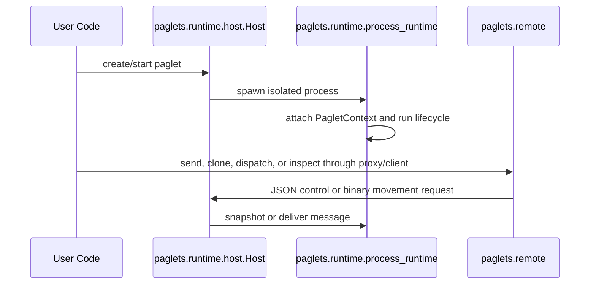

# Technical Overview

The source tree is organized by runtime topic. Import from the module that owns
the behavior you need; the root `paglets` package and topic package
`__init__.py` files do not re-export implementation symbols.

## Package Map

`paglets.core`
: Authoring primitives: paglet base classes, messages, lifecycle events,
  itinerary planning, runtime enums, and project exceptions.

`paglets.runtime`
: Host execution internals: host supervision, child-process control, mailbox
  delivery, movement envelopes, HTTP routing, relay delivery, bind-address
  resolution, and resource cleanup.

`paglets.artifacts`
: Binary artifact value types, host-owned blob storage, checksum helpers, and
  registered-file metadata used by natural paglet file mobility.

`paglets.patterns`
: Additive typed helpers for common application paglets: request/result task
  routing, multi-operation routing, mesh fan-out coordination, cursor drains,
  non-fatal user-info notifications, and single-file mobility tasks.

`paglets.remote`
: Remote communication: HTTP client, proxies, transfer tickets, transport
  helpers, mesh membership, and administration clients.

`paglets.persistence`
: Durable inactive paglet records and managed per-paglet storage.

`paglets.services`
: Service contracts, service registry records, and resident service lease
  metadata.

`paglets.system`
: Built-in resident services such as host system information, mesh resource
  landscape, compute-slot scheduling, and user notifications.

`paglets.serialization`
: Dataclass wire conversion and qualified-name import resolution.

`paglets.config`
: Launch configuration parsing, bundled defaults, and startup synchronization.

`paglets.tooling`
: Command-line entry points, local paglet class discovery, and git auto-update.

## Runtime Flow



The host owns orchestration and durable records. Active paglet code runs in
spawned child processes. Remote hosts exchange small control data as JSON and
mobile state through streamed pickle payloads.

## Import Policy

Use explicit module imports:

```python
from paglets.core.agent import Paglet, PagletState
from paglets.core.messages import Message
from paglets.runtime.host import Host
from paglets.remote.proxy import PagletProxy
```

Flat imports such as `from paglets import Host` and `from paglets.messages
import Message` are intentionally unsupported.

## Related Pages

- [Core](core.md) explains the paglet authoring model.
- [Runtime](runtime.md) explains host and child-process behavior.
- [Artifacts](artifacts.md) documents binary artifact types and storage.
- [Patterns](patterns.md) documents typed task, operation, coordination, and
  file mobility helpers.
- [Remote](remote.md) explains proxies, transport, mesh, and admin clients.
- [Persistence](persistence.md), [Services](services.md),
  [Serialization](serialization.md), [Configuration](configuration.md), and
  [Tooling](tooling.md) cover supporting subsystems.
